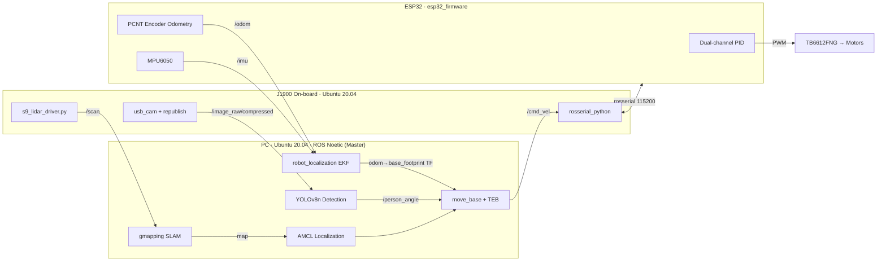

<p align="center">
  
</p>

# ROS Differential-Drive Autonomous Mobile Robot 🤖

<p align="right">
  English | <a href="README.md">简体中文</a>
</p>

> **A differential-drive autonomous mobile robot platform built on ROS Noetic + ESP32 + J1900 + LiDAR**
> A complete open-source implementation from motor PID up to SLAM / navigation / human following, across a three-machine distributed architecture. Reproducible and extensible.

[](https://github.com/lawliet206/ROS/actions/workflows/ci.yml)
[](LICENSE)
[](https://wiki.ros.org/noetic)
[](https://releases.ubuntu.com/20.04/)
[](docs/system_architecture.png)

---

## ✨ Key Features

| Feature | Stack | Status |
|---------|-------|--------|
| 🗺️ **SLAM Mapping** | S9 LiDAR (reverse-engineered AA55 protocol) + gmapping | ✅ Verified on hardware |
| 🧭 **Autonomous Navigation** | AMCL localization + move_base + **TEB** local planner | ✅ Verified on hardware |
| 🎯 **Multi-waypoint Patrol** | One-command launch + YAML waypoints + loop execution | ✅ Verified on hardware |
| 🚶 **Human Following** | Vision for bearing + LiDAR for range, tri-state fused state machine | ✅ Verified on hardware |
| 🔗 **EKF Fusion** | robot_localization (encoder odometry + MPU6050 IMU) | ✅ Built in |
| 🎮 **Simulation** | Gazebo empty room + diff-drive plugin + identical navigation stack | ✅ Ready |

---

## 🏗️ System Architecture

Three-machine distributed setup: **PC** (compute) ←WiFi→ **J1900** (on-board sensing) ←USB→ **ESP32** (chassis control)

```
ROS PC (Master)                    J1900 (on-board)                 ESP32 (lower MCU)
┌──────────────────┐        WiFi  ┌──────────────────┐   USB   ┌──────────────────┐
│  SLAM / EKF      │◄─────────────│  s9_lidar_driver │◄────────│ Dual-channel PID │
│  AMCL / move_base│   ROS Topics │  usb_cam+republish│  rosserial│ PCNT encoders   │
│  TEB / YOLOv8n   │─────────────►│  LiDAR + camera  │────────►│ MPU6050 IMU      │
└──────────────────┘   cmd_vel    └──────────────────┘  serial └─────────┬────────┘
                                                                            │ PWM
                                                                       ┌──▼────────┐
                                                                       │ TB6612FNG │
                                                                       │ L/R motors│
                                                                       └───────────┘
Data flow: LiDAR → /scan → SLAM → map → AMCL → move_base → /cmd_vel → ESP32 → PID → Motors
```



---

## 🔧 Hardware

| Component | Model | Key Specs |
|-----------|-------|-----------|
| Lower MCU | ESP32-WROOM-32 | PCNT hardware encoders + dual PID + IMU |
| On-board PC | Intel Celeron J1900 | x86_64, Ubuntu 20.04, ROS Noetic |
| Main PC | Laptop | ROS Master, SLAM / navigation / vision |
| LiDAR | S9-FSRD-V1.0 RX | 115200 baud, AA55 protocol, 360° scan, ~69 Hz |
| Motors | JGB37-520 ×2 | 12 V, gear ratio 1:10, 11 PPR Hall encoders |
| Motor driver | TB6612FNG | Dual H-bridge, 3.3 V logic direct to ESP32 |
| Wheels | 85 mm rubber | Track width **180 mm** (URDF/firmware/sim aligned) |
| IMU | MPU6050 | I2C, used for EKF fusion & scan de-skew |
| Battery | 3S LiPo 11.1 V 5200 mAh | XT60 connector |

**Wiring (TB6612FNG ↔ ESP32)**

```
AIN1→GPIO25  AIN2→GPIO26  PWMA→GPIO18
BIN1→GPIO32  BIN2→GPIO33  PWMB→GPIO19
STBY→GPIO4(pulled high)  VCC→3.3V  VM→battery 12V

Encoders: LeftA→GPIO27 LeftB→GPIO23 RightA→GPIO14 RightB→GPIO13
MPU6050: SDA→GPIO21  SCL→GPIO22
```

### Schematic & PCB (self-designed hardware, finalized 2026-07)

<p align="center">
  
  
  <br/>
  <em>Left: controller board schematic　Right: PCB front (motor driver / encoders / IMU / rosserial fully integrated)</em>
</p>

<p align="center">
  
  <br/>
  <em>PCB back (power / LiDAR / camera connectors)</em>
</p>

---

## 🧩 Software Stack

| Layer | Component | Notes |
|-------|-----------|-------|
| Simulation | Gazebo / RViz | 15m×15m room + diff-drive plugin + same navigation params |
| Mapping | gmapping | Subscribes `/scan_deskewed` (IMU de-skew supported) |
| Localization | AMCL | 100–500 particles (hardware) / 500–3000 (sim), diff-corrected odometry model |
| Planning | move_base + **TEB** | navfn global + TEB local, max_vel_x=0.6 |
| Fusion | robot_localization EKF | odom+imu → `/odometry/filtered` (30 Hz) |
| Comms | rosserial (115200) | PC↔J1900 WiFi, J1900↔ESP32 USB |
| Perception | YOLOv8n | Person detection over compressed image stream (320×240) |
| Control | Dual PID (in firmware) | Closed-loop speed + stall protection + watchdog |

---

## 🚀 Quick Start

### 1. Install (full steps in [SETUP.md](SETUP.md), Chinese)

```bash
# Install ROS Noetic and all dependencies on Ubuntu 20.04
sudo apt install ros-noetic-desktop-full
sudo apt install ros-noetic-gmapping ros-noetic-move-base ros-noetic-amcl \
                 ros-noetic-map-server ros-noetic-teleop-twist-keyboard \
                 ros-noetic-robot-state-publisher ros-noetic-topic-tools \
                 ros-noetic-robot-localization ros-noetic-teb-local-planner \
                 ros-noetic-tf ros-noetic-interactive-markers
```

### 2. Build

```bash
cd ~/ROS
source /opt/ros/noetic/setup.bash
catkin_make
source devel/setup.bash
```

### 3. Simulation (no hardware needed)

```bash
# SLAM mapping (drive around with teleop_twist_keyboard in another terminal)
bash src/robot_sim/scripts/sim_slam.sh

# Save the map when finished
rosrun map_server map_saver -f ~/maps/sim_map

# Navigation (map required first)
bash src/robot_sim/scripts/sim_navigation.sh ~/maps/sim_map.yaml
```

### 4. Physical robot (PC + J1900 + ESP32 + LiDAR)

```bash
# status / one-key mapping / patrol / human following / stop
bash src/robot_bringup/scripts/robot_start.sh status
bash src/robot_bringup/scripts/robot_start.sh slam
bash src/robot_bringup/scripts/robot_start.sh patrol ~/maps/lab_map.yaml
bash src/robot_bringup/scripts/robot_start.sh follow
bash src/robot_bringup/scripts/robot_start.sh stop   # publishes zero velocity immediately
```

### 5. Unit Tests

```bash
python3 -m pip install -r requirements-dev.txt   # numpy + pytest
python3 -m pytest tests -q
# 61 regression tests: LiDAR protocol parsing+buffer/cross-zero(23) + following state machine(12)
#                      + detection frame processing(9) + scan de-skew/IMU window mean(11) + patrol goals(6)
# No ROS environment needed: tests/conftest.py stubs rospy/messages; CI also runs all tests in a ros:noetic container
```

---

## 📸 Field Results

<p align="center">
  
  <br/>
  <em>Self-built differential-drive chassis (ESP32 controller + J1900 on-board PC + S9 LiDAR + camera)</em>
</p>

<p align="center">
  <a href="assets/demo.mp4"></a>
  <br/>
  <em>▶ <a href="assets/demo.mp4">Live demo video (MP4)</a></em>
</p>

<p align="center">
  
  <br/>
  <em>Real-time LiDAR point-cloud mapping in RViz (gmapping)</em>
</p>

---

## 📁 Project Layout

```
ROS/                          # catkin workspace root
├── AGENTS.md                 # Coding agent project guide
├── SETUP.md                  # Full deployment manual (env/network/wiring/power-up/FAQ, Chinese)
├── src/
│   ├── robot_bringup/        # ★ Hardware package (deployed on PC + J1900)
│   │   ├── launch/           # bringup/slam/navigation/follow/follow_vision/ekf/odom_ekf
│   │   ├── scripts/          # robot_start.sh / j1900_start.sh + 6 Python nodes
│   │   ├── config/           # ekf.yaml / patrol_goals.yaml / slam.rviz
│   │   └── urdf/robot.urdf   # Hardware model (track width 0.180 m)
│   └── robot_sim/            # Simulation package (PC only, Gazebo)
│       ├── launch/           # simulation / sim_slam / sim_navigation
│       ├── scripts/          # sim_slam.sh / sim_navigation.sh / sim_follow.sh
│       ├── urdf/ worlds/ rviz/ config/
├── esp32_firmware/           # ESP32 firmware (built with Arduino IDE, independent of ROS)
│   ├── esp32_firmware.ino    # ★ Main firmware (PCNT + PID + IMU + rosserial)
│   ├── esp32_board_test/     # Board-level test firmware (per-item verification)
│   └── libraries/ros_lib/    # vendored rosserial library (ESP32 compatibility fixed)
├── tests/                    # pytest regression tests (61 cases, no hardware needed)
├── assets/                   # Photos / demo video / mapping screenshots
├── tools/                    # Debug utilities (not part of the deployment chain)
└── docs/                     # Architecture diagram / dev guides / project documents
```

---

## 📚 Documentation

| Document | Contents |
|----------|----------|
| [SETUP.md](SETUP.md) | Full deployment: environment, network, wiring, first power-on, sim & robot operation, FAQ (Chinese) |
| [docs/ARCHITECTURE.md](docs/ARCHITECTURE.md) | Architecture: three-machine data flow, TF tree, node/launch inventory, safety mechanisms (Chinese) |
| [docs/PROJECT_STATUS.md](docs/PROJECT_STATUS.md) | Component status matrix, test coverage, known limitations, roadmap (Chinese) |
| [CHANGELOG.md](CHANGELOG.md) | Change log (all entries from real git history, Chinese) |
| [CONTRIBUTING.md](CONTRIBUTING.md) | Contributing guide with English abstract: environment, tests, hardware safety rules, PR process |
| [SECURITY.md](SECURITY.md) | Security policy and vulnerability reporting |
| [CODE_OF_CONDUCT.md](CODE_OF_CONDUCT.md) | Contributor Code of Conduct (Contributor Covenant v2.1) |
| [docs/developer-guide.md](docs/developer-guide.md) | Developer toolchain reference (Chinese) |
| [docs/system_architecture.png](docs/system_architecture.png) | System architecture diagram (regenerate via `tools/generate_architecture.py`) |

---

## 🧑‍💻 Contributing

This project runs on a real robot platform. **Issues and PRs are welcome** (please read [CONTRIBUTING.md](CONTRIBUTING.md) first):

- 🐛 Report bugs / suggest features → [Open an Issue](https://github.com/lawliet206/ROS/issues/new/choose)
- 🔧 Submit code → fork + PR; CI automatically runs static checks + catkin_make in a container + pytest
- 📣 Known issues & roadmap → [docs/PROJECT_STATUS.md](docs/PROJECT_STATUS.md)

**Community standards**: this project does not fabricate verification results — every "verified on hardware" mark is backed by real commits and field records. Please report security vulnerabilities privately per [SECURITY.md](SECURITY.md).

---

## 🛡️ Hardware Safety

- The robot stays still after startup/restart; teleop mapping is capped at **0.3 m/s**
- `robot_start.sh stop` immediately publishes zero velocity to `/cmd_vel`
- For first-time debugging, lift the wheels off the ground or test on the floor at ≤0.3 m/s
- ROS Master binds to LAN only — never expose it to untrusted networks

---

## 📄 License

This project is released under the [MIT License](LICENSE). Third-party components (rosserial Arduino library, YOLOv8, ROS ecosystem tools) remain under their respective licenses.
