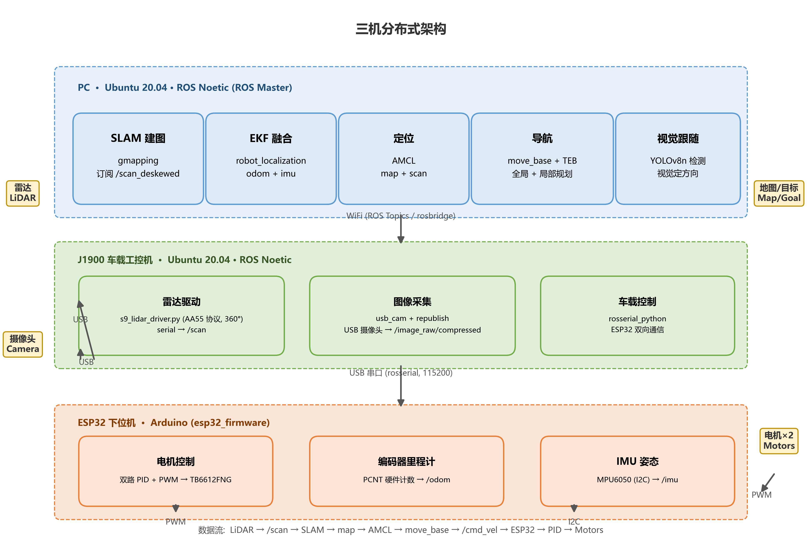
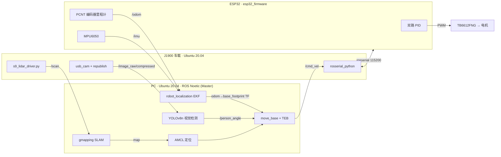
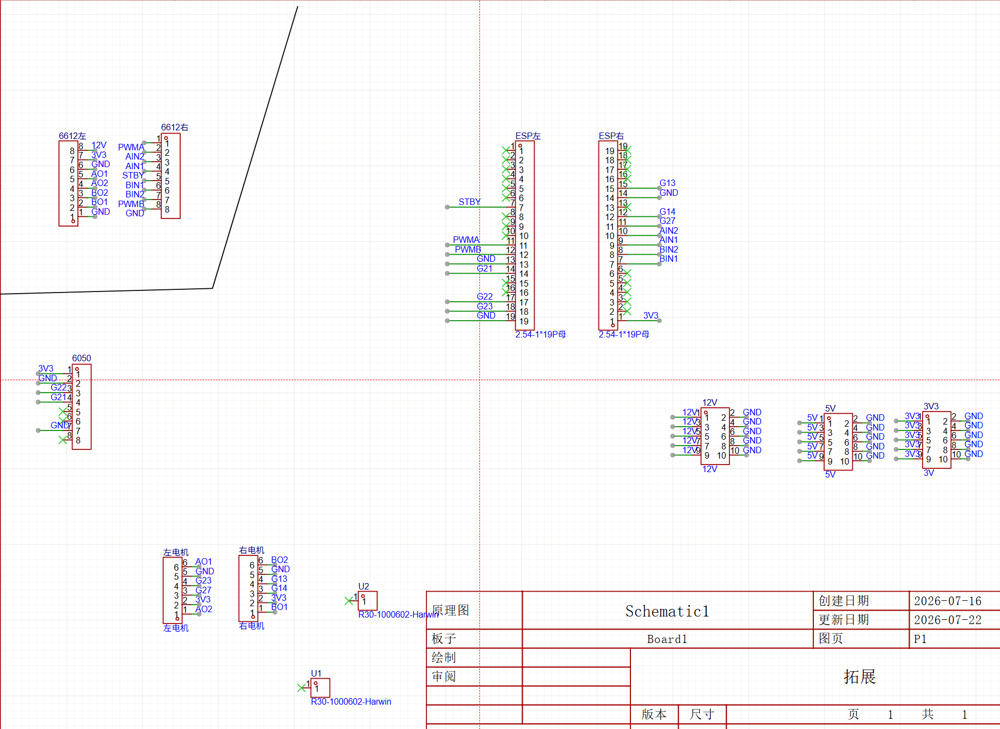
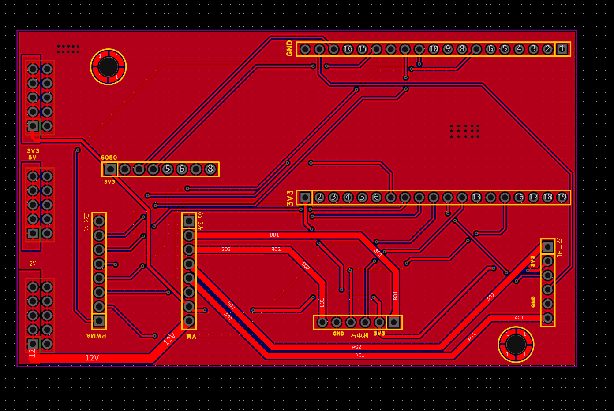
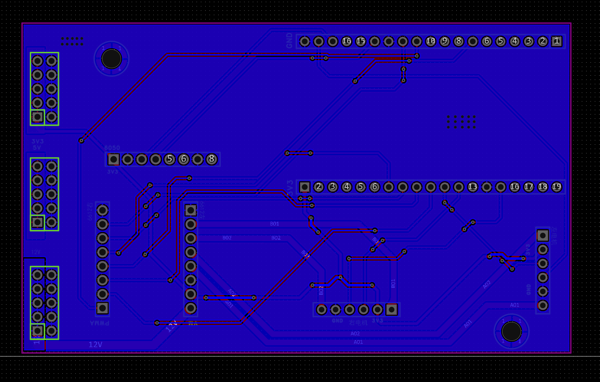
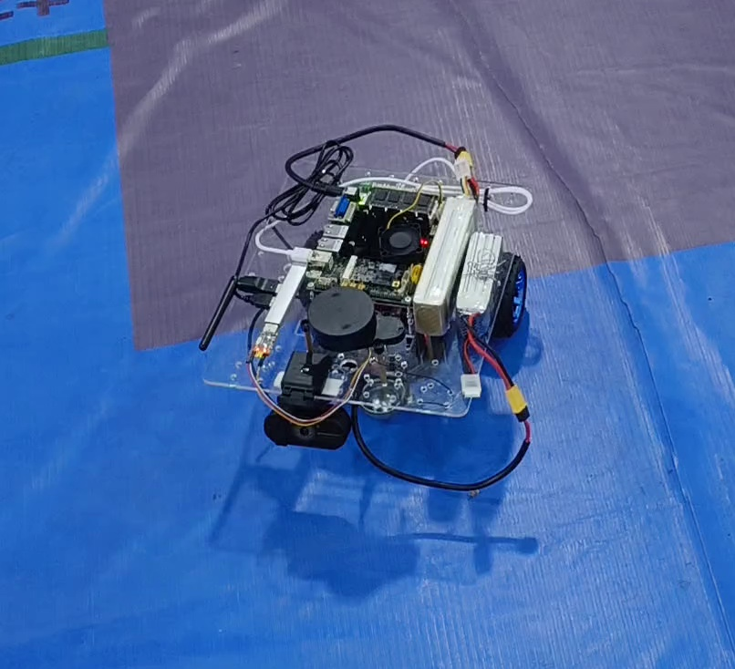
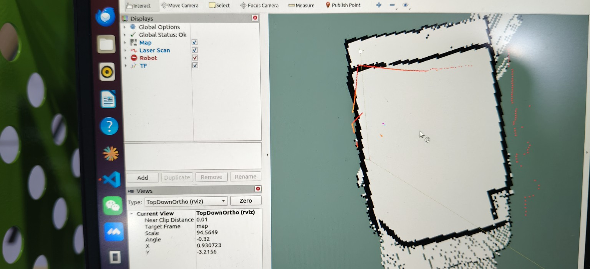
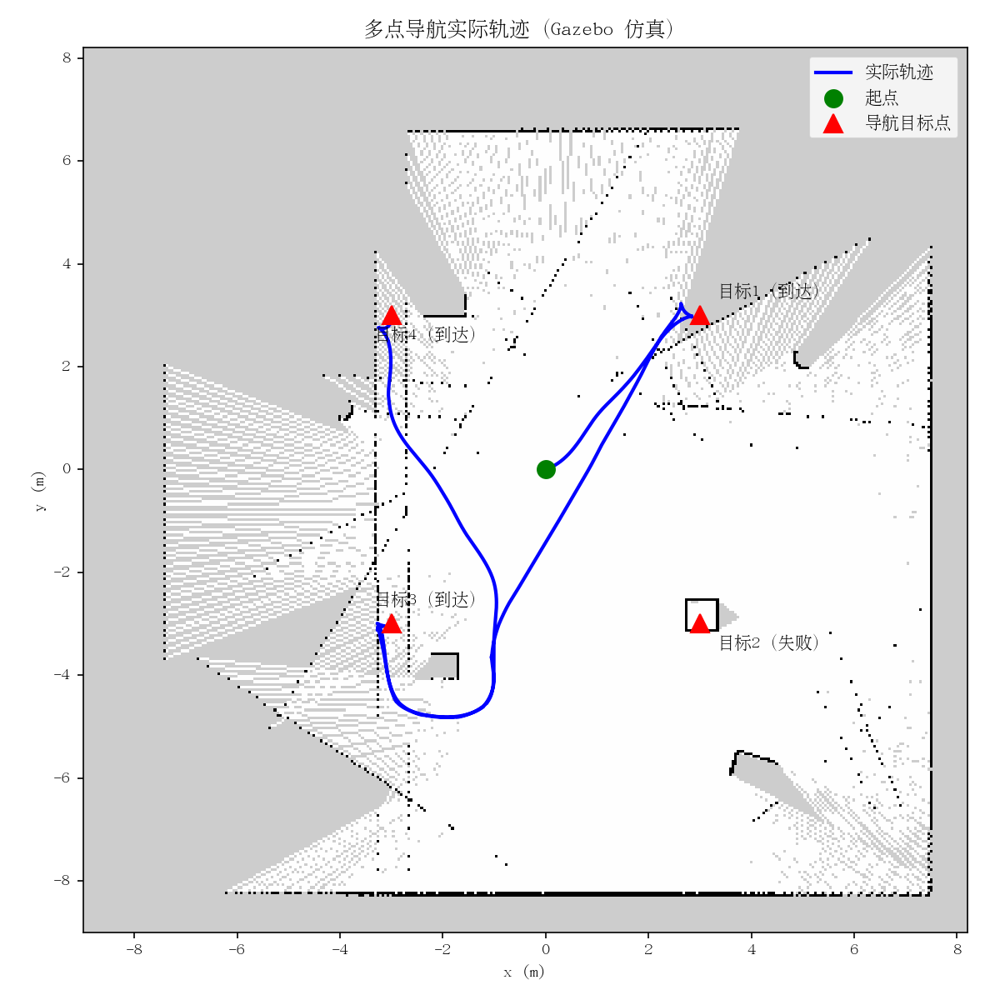

<p align="center">
  
</p>

# ROS 两轮差速自主移动机器人 🤖

<p align="right">
  <a href="README.en.md">English</a> | 简体中文
</p>

> **ROS Noetic + ESP32 + J1900 + LiDAR 的两轮差速自主移动机器人平台**
> 从电机 PID 到 SLAM/导航/人体跟随的完整开源实现，三机分布式架构，可复现可扩展。

[](https://github.com/lawliet206/ROS/actions/workflows/ci.yml)
[](LICENSE)
[](https://wiki.ros.org/noetic)
[](https://releases.ubuntu.com/20.04/)
[](docs/system_architecture.png)

---

## ✨ 核心功能

| 功能 | 技术栈 | 状态 |
|------|--------|------|
| 🗺️ **SLAM 建图** | S9 雷达（AA55 协议逆向） + gmapping | ✅ 实机验证 |
| 🧭 **自主导航** | AMCL 定位 + move_base + **TEB** 局部规划 | ✅ 实机验证 |
| 🎯 **多点巡航** | 一键启动 + YAML 巡航点 + 循环执行 | ✅ 实机验证 |
| 🚶 **人体跟随** | **视觉定方向 + 雷达定距离** 三态融合状态机 | ✅ 实机验证 |
| 🔗 **EKF 融合** | robot_localization（编码器里程计 + MPU6050 IMU） | ✅ 已内置 |
| 🎮 **仿真环境** | Gazebo 空房间 + 差速插件 + 同款导航栈 | ✅ 可用 |

---

## 🏗️ 系统架构

三机分布式：**PC**（算力）←WiFi→ **J1900**（车载采集）←USB→ **ESP32**（底盘控制）

```
ROS PC (Master)                    J1900 (车载)                     ESP32 (下位机)
┌──────────────────┐        WiFi  ┌──────────────────┐   USB   ┌──────────────────┐
│  SLAM / EKF      │◄─────────────│  s9_lidar_driver │◄────────│ 双路 PID          │
│  AMCL / move_base│   ROS Topics │  usb_cam+republish│  rosserial│ PCNT 编码器里程计  │
│  TEB / YOLOv8n   │─────────────►│  雷达+摄像头采集   │────────►│ MPU6050 IMU       │
└──────────────────┘   cmd_vel    └──────────────────┘  串口    └─────────┬────────┘
                                                                            │ PWM
                                                                       ┌──▼────────┐
                                                                       │ TB6612FNG │
                                                                       │ 左/右电机  │
                                                                       └───────────┘
数据流: LiDAR → /scan → SLAM → map → AMCL → move_base → /cmd_vel → ESP32 → PID → Motors
```



---

## 🔧 硬件

| 组件 | 型号 | 关键参数 |
|------|------|----------|
| 下位机 | ESP32-WROOM-32 | PCNT 硬件编码器 + 双路 PID + IMU |
| 车载工控机 | Intel Celeron J1900 | x86_64, Ubuntu 20.04, ROS Noetic |
| 主控 PC | 笔记本 | ROS Master，SLAM/导航/视觉 |
| 激光雷达 | S9-FSRD-V1.0 RX | 115200, AA55 协议, 360° 扫描, ~69Hz |
| 电机 | JGB37-520 ×2 | 12V, 减速比 1:10, 11 PPR 霍尔编码器 |
| 电机驱动 | TB6612FNG | 双路 H 桥，3.3V 逻辑直连 ESP32 |
| 轮子 | 85mm 橡胶轮 | 轮距 **180mm**（URDF/固件/仿真全对齐） |
| IMU | MPU6050 | I2C，用于 EKF 融合与激光去畸变 |
| 电池 | 3S LiPo 11.1V 5200mAh | XT60 接口 |

**引脚接线（TB6612FNG ↔ ESP32）**

```
AIN1→GPIO25  AIN2→GPIO26  PWMA→GPIO18
BIN1→GPIO32  BIN2→GPIO33  PWMB→GPIO19
STBY→GPIO4(拉高)  VCC→3.3V  VM→电池12V

编码器: 左A→GPIO27 左B→GPIO23 右A→GPIO14 右B→GPIO13
MPU6050: SDA→GPIO21  SCL→GPIO22
```

### 原理图与 PCB（自绘硬件，2026-07 定型）

<p align="center">
  
  
  <br/>
  <em>左: ESP32 主控板原理图　右: PCB 正面（电机驱动 / 编码器 / IMU / rosserial 全集成）</em>
</p>

<p align="center">
  
  <br/>
  <em>PCB 反面（电源 / 雷达 / 摄像头接口）</em>
</p>

---

## 🧩 软件栈

| 层 | 组件 | 说明 |
|----|------|------|
| 仿真 | Gazebo / RViz | 15m×15m 房间 + 差速插件 + 同款导航参数 |
| 建图 | gmapping | 订阅 `/scan_deskewed`（支持 IMU 去畸变） |
| 定位 | AMCL | 100~500 粒子（实物）/ 500~3000（仿真），diff-corrected 里程计模型 |
| 规划 | move_base + **TEB** | navfn 全局 + TEB 局部，max_vel_x=0.6 |
| 融合 | robot_localization EKF | odom+imu → `/odometry/filtered`（30Hz） |
| 通信 | rosserial (115200) | PC↔J1900 WiFi，J1900↔ESP32 USB |
| 感知 | YOLOv8n | 人体检测，压缩图像流 (320×240) |
| 控制 | 双路 PID（固件内） | 速度闭环 + 堵转保护 + 看门狗 |

---

## 🚀 快速开始

### 1. 安装（完整步骤见 [SETUP.md](SETUP.md)）

```bash
# Ubuntu 20.04 下安装 ROS Noetic 及全部依赖
sudo apt install ros-noetic-desktop-full
sudo apt install ros-noetic-gmapping ros-noetic-move-base ros-noetic-amcl \
                 ros-noetic-map-server ros-noetic-teleop-twist-keyboard \
                 ros-noetic-robot-state-publisher ros-noetic-topic-tools \
                 ros-noetic-robot-localization ros-noetic-teb-local-planner \
                 ros-noetic-tf ros-noetic-interactive-markers
```

### 2. 编译

```bash
cd ~/ROS
source /opt/ros/noetic/setup.bash
catkin_make
source devel/setup.bash
```

### 3. 仿真（无需硬件）

```bash
# SLAM 建图（再开一个终端用 teleop_twist_keyboard 遥控绕场）
bash src/robot_sim/scripts/sim_slam.sh

# 建图完成后保存地图
rosrun map_server map_saver -f ~/maps/sim_map

# 导航（需先建图）
bash src/robot_sim/scripts/sim_navigation.sh ~/maps/sim_map.yaml
```

### 4. 实物机器人（PC + J1900 + ESP32 + 雷达）

```bash
# 状态查看 / 一键建图 / 多点巡航 / 人体跟随 / 停止
bash src/robot_bringup/scripts/robot_start.sh status
bash src/robot_bringup/scripts/robot_start.sh slam
bash src/robot_bringup/scripts/robot_start.sh patrol ~/maps/lab_map.yaml
bash src/robot_bringup/scripts/robot_start.sh follow
bash src/robot_bringup/scripts/robot_start.sh stop   # 立即发送零速度
```

### 5. 单元测试

```bash
python3 -m pip install -r requirements-dev.txt   # numpy + pytest
python3 -m pytest tests -q
# 61 例回归测试: 雷达协议解析+缓冲/跨零(23) + 跟随状态机(12) + 检测帧处理(9)
#               + 激光去畸变/IMU窗均值(11) + 巡航目标解析(6)
# 无需 ROS 环境: tests/conftest.py 提供 rospy/消息替身; CI 还会在 ros:noetic 容器中执行全部测试
```

---

## 📸 实测效果

<p align="center">
  
  <br/>
  <em>自制两轮差速底盘（ESP32 主控 + J1900 车载 + S9 雷达 + 摄像头）</em>
</p>

<p align="center">
  <a href="assets/demo.mp4"></a>
  <br/>
  <em>▶ <a href="assets/demo.mp4">实物运行演示视频（MP4）</a></em>
</p>

<p align="center">
  
  
  <br/>
  <em>左: RViz 实机雷达点云建图　右: gmapping 实机建图</em>
</p>

<p align="center">
  
  <br/>
  <em>多点导航路径规划</em>
</p>

---

## 📁 项目结构

```
ROS/                          # catkin 工作空间根
├── AGENTS.md                 # Coding Agent 项目指南
├── SETUP.md                  # 完整部署手册（环境/网络/接线/上电/FAQ）
├── src/
│   ├── robot_bringup/        # ★ 实物包（PC + J1900 部署）
│   │   ├── launch/           # bringup/slam/navigation/follow/follow_vision/ekf/odom_ekf
│   │   ├── scripts/          # robot_start.sh / j1900_start.sh + 6 个 Python 节点
│   │   ├── config/           # ekf.yaml / patrol_goals.yaml / slam.rviz
│   │   └── urdf/robot.urdf   # 实物模型（轮距 0.180m）
│   └── robot_sim/            # 仿真包（仅 PC，Gazebo）
│       ├── launch/           # simulation / sim_slam / sim_navigation
│       ├── scripts/          # sim_slam.sh / sim_navigation.sh / sim_follow.sh
│       ├── urdf/ worlds/ rviz/ config/
├── esp32_firmware/           # ESP32 固件（Arduino 编译，独立于 ROS）
│   ├── esp32_firmware.ino    # ★ 主固件（PCNT + PID + IMU + rosserial）
│   ├── esp32_board_test/     # 板级测试固件（单项验证）
│   └── libraries/ros_lib/    # vendored rosserial 库（已修复 ESP32 兼容）
├── tests/                    # pytest 回归测试（61 例，无硬件依赖）
├── assets/                   # 实物照片 / 演示视频 / 建图截图
├── tools/                    # 调试工具（不入部署链）
└── docs/                     # 架构图 / 开发指南 / 项目文档
```

---

## 📚 文档

| 文档 | 内容 |
|------|------|
| [SETUP.md](SETUP.md) | 完整部署：环境安装、网络、接线、首次上电、仿真与实物操作、FAQ |
| [docs/ARCHITECTURE.md](docs/ARCHITECTURE.md) | 系统架构：三机数据流、TF 树、节点/launch 清单、安全机制 |
| [docs/PROJECT_STATUS.md](docs/PROJECT_STATUS.md) | 组件状态矩阵、测试覆盖、已知限制、路线图 |
| [CHANGELOG.md](CHANGELOG.md) | 变更记录（全部来自真实 git 历史） |
| [CONTRIBUTING.md](CONTRIBUTING.md) | 贡献指南：环境、测试、硬件安全红线、PR 流程（含英文摘要） |
| [SECURITY.md](SECURITY.md) | 安全策略与漏洞报告方式 |
| [docs/MAINTAINER_WORKFLOW.md](docs/MAINTAINER_WORKFLOW.md) | 维护者工作流：AI 工具链（Codex 等）使用规范与人工审查要求 |
| [AGENTS.md](AGENTS.md) | Coding Agent 项目指南（AI 工具链维护参考） |
| [docs/developer-guide.md](docs/developer-guide.md) | 开发者工具链参考（MCP / Skills / Git 速查） |
| [docs/system_architecture.png](docs/system_architecture.png) | 系统架构图（`tools/generate_architecture.py` 可重新生成） |

---

## 🧑‍💻 参与贡献

本项目是真实运行的机器人平台，**欢迎 Issue 与 PR**（请先读 [CONTRIBUTING.md](CONTRIBUTING.md)）：

- 🐛 报告 Bug / 提出功能建议 → [新建 Issue](https://github.com/lawliet206/ROS/issues/new/choose)
- 🔧 提交代码 → fork 后 PR，CI 会自动运行静态检查 + 容器内 catkin_make + pytest
- 📣 已知问题与路线图 → [docs/PROJECT_STATUS.md](docs/PROJECT_STATUS.md)

**社区准则**：本项目承诺不伪造验证结果——所有"实机验证"标记均有真实提交与论文实验图佐证；任何安全漏洞请按 [SECURITY.md](SECURITY.md) 私下报告。

---

## 🛡️ 硬件安全

- 启动后小车保持静止，遥控建图默认速度 **0.3 m/s 封顶**
- `robot_start.sh stop` 立即向 `/cmd_vel` 发布零速度
- 首次调试请架空轮子或低速（≤0.3 m/s）落地测试
- ROS Master 仅绑定局域网，不暴露到不可信网络

---

## 📄 许可证

本项目基于 [MIT License](LICENSE) 开源。第三方组件（rosserial Arduino 库、YOLOv8、ROS 生态工具）遵循其各自许可证。