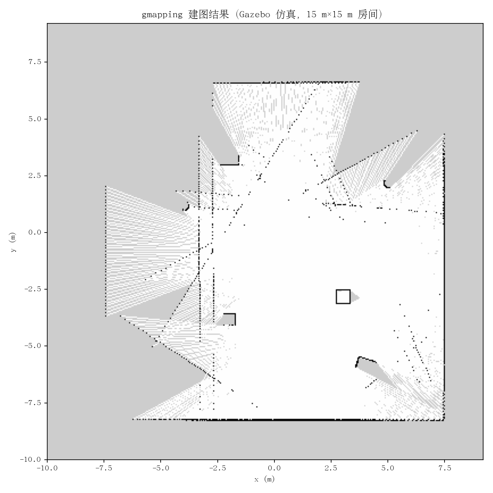
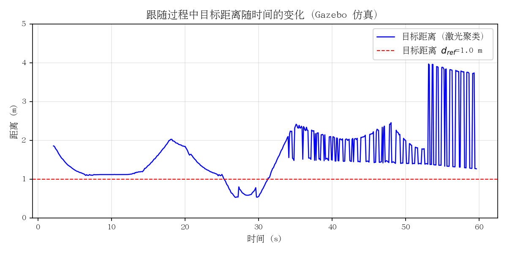
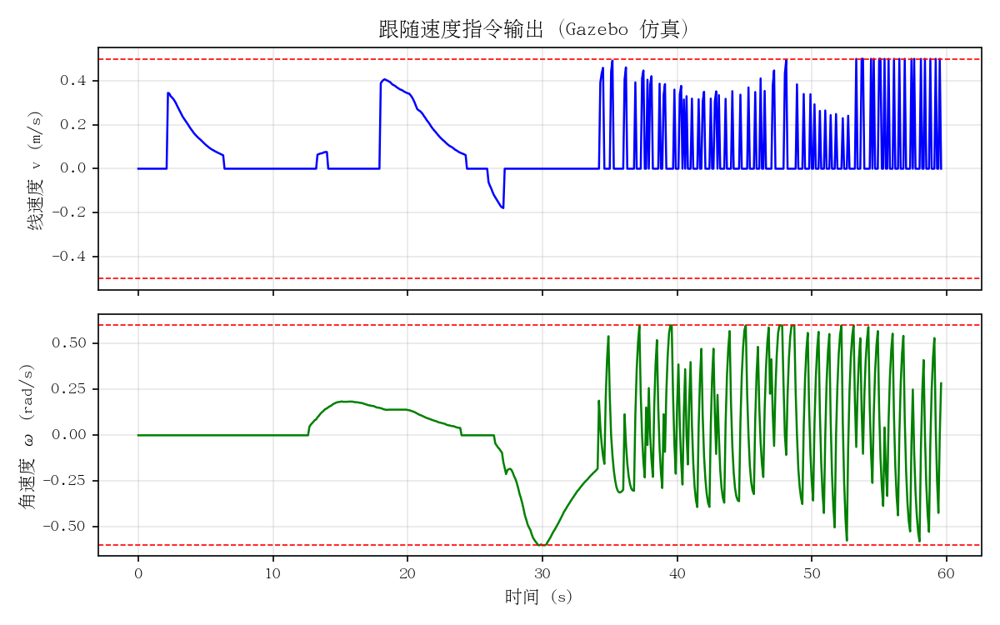

# 基于 ROS 的两轮差速移动机器人设计与实现

## ——激光 SLAM、自主导航与视觉—激光融合人体跟随

**学　　院：** ____________________
**专　　业：** ____________________
**学生姓名：** ____________________
**学　　号：** ____________________
**指导教师：** ____________________
**完成日期：** ____________________

---

## 摘　要

移动机器人要在室内完成自主导航、跟随人这类任务，离不开 ROS 这类能把算法和硬件串起来的软件框架。ROS 提供标准化的通信机制和大量现成算法包，这两年我在这套框架上搭了一台两轮差速小车，把从电机驱动到上层导航的整条链路都走了一遍[1-3]。

论文围绕这台小车的实现展开，主要做了四件事：

（1）整机采用"PC—车载工控机—下位机"三机架构。PC 端作为 ROS Master，跑 SLAM、路径规划和视觉检测这些算力要求高的节点；J1900 工控机放在车上，负责激光雷达驱动和图像采集压缩；ESP32 下位机通过 rosserial 协议完成电机 PID 控制、编码器里程计和 IMU 姿态解算。三层分工下来，每台设备只干自己擅长的事。

（2）S9 激光雷达的协议没有公开，原始数据质量也差。我对着串口抓包把它的定长帧格式逆向了出来，实现了 360° 扫描合成，距离和角度都做了实测标定，解析逻辑配了 15 项回归测试防退化。编码器里程计和 IMU 则用扩展卡尔曼滤波（EKF）做了融合，单一传感器的误差被压下去一些。

（3）建图用 gmapping，定位用 AMCL，路径规划用 move_base 加 TEB 局部规划器，在 15 m 的室内场景里实现了多点自主导航。启动流程被我封装成一键脚本，不用每次开一堆终端[4-10]。

（4）人体跟随用了"视觉定方向、激光定距离"的融合思路。视觉通道用 YOLOv8n 检测人体并算偏角[11-13]，激光通道对扫描聚类取目标距离，两者通过"跟随—搜索—停止"三态状态机融合成速度指令。单激光雷达角度分辨率不够，单目视觉又没有深度，两个通道正好互补[14-16]。

实测时，建图和多点导航都能一键跑起来；人在前面以 1.2 m/s 的速度散步，小车能稳定保持距离；人走出视野后，小车会先 ±60° 摇摆搜索，找到人后自动恢复跟随。全部代码已开源（51 次提交、6800 余行），配了部署文档和三级测试，照着文档可以复现整套系统。

**关键词：** ROS；两轮差速；激光 SLAM；自主导航；人体跟随；多传感器融合；YOLOv8

---

## Abstract

Mobile robots that can navigate autonomously and follow humans indoors depend heavily on software frameworks like ROS, which provide standardized communication and a rich set of ready-made algorithm packages. Over the past two years I built a two-wheel differential-drive robot on this framework and walked through the whole pipeline, from motor drivers up to high-level navigation [1-3].

The thesis describes this robot's implementation in four parts:

(1) A three-machine distributed architecture of "PC–onboard industrial computer–microcontroller". The PC acts as the ROS Master and runs compute-heavy nodes such as SLAM, path planning, and visual detection. The onboard J1900 industrial computer handles the LiDAR driver and compressed image acquisition. The ESP32 microcontroller implements motor PID control, encoder odometry, and IMU attitude estimation via the rosserial protocol, so each device does what it is good at.

(2) The S9 low-cost LiDAR has no publicly documented protocol and produces noisy data. I reverse-engineered its fixed-length frame format from serial packet captures, implemented 360° scan synthesis, and calibrated both distance and angle on real measurements, with 15 regression tests to keep the parser correct. Encoder odometry and IMU data are fused with an Extended Kalman Filter (EKF), which reduces the error of either sensor alone.

(3) For mapping and navigation, gmapping is used for 2D LiDAR mapping, AMCL for global localization, and the move_base framework with the TEB local planner for trajectory execution, achieving multi-goal autonomous navigation in a 15 m indoor scene. The startup flow is packaged into one-command scripts so there is no need to open a pile of terminals [4-10].

(4) Human following uses a fused strategy of "vision determines bearing, LiDAR determines range". The vision channel detects humans with YOLOv8n and computes the bearing angle [11-13]; the range channel clusters the laser scan to get the target distance. Both channels are combined by a "follow–search–stop" three-state state machine that outputs velocity commands. The two channels compensate for each other's weakness: a single low-cost LiDAR lacks angular resolution, while monocular vision has no depth information [14-16].

In experiments, mapping and multi-goal navigation both start with a single command. The robot keeps a stable distance while following a person walking at 1.2 m/s, and after the target leaves the field of view, it sweeps ±60° to search and automatically resumes following once the person is found again. All code is open-sourced (51 commits, 6,800+ lines) with deployment documentation and a three-level test system, so the whole system can be reproduced by following the docs.

**Keywords:** ROS; two-wheel differential robot; LiDAR SLAM; autonomous navigation; human following; multi-sensor fusion; YOLOv8

---

## 目　录

- 第 1 章　绪论
- 第 2 章　相关技术基础
- 第 3 章　系统需求分析与总体设计
- 第 4 章　硬件平台设计与实现
- 第 5 章　底层驱动与数据预处理
- 第 6 章　SLAM 建图与自主导航
- 第 7 章　视觉—激光融合的人体跟随
- 第 8 章　系统测试与结果分析
- 第 9 章　总结与展望
- 参考文献
- 致谢
- 附录

---

## 第 1 章　绪论

### 1.1　研究背景与意义

移动机器人现在已经从遥控玩具发展到能自己感知环境、做决策的形态，仓储物流、家庭服务、巡检安防里都能看到它的影子。一台能用的移动机器人，核心要解决三件事：知道自己在哪里（SLAM 定位建图）、怎么走到目标点（路径规划）、以及跟着目标走（目标跟踪与跟随）。SLAM 解决"我在哪、周围是什么"，是自主导航的前提；路径规划负责在已知地图上找一条安全的路；人体跟随则要求机器人在运动中持续感知并跟踪目标，保持安全距离[17-18]。

这三件事在学术上都有成熟的研究，但要在成本有限的实体小车上落地，工程上麻烦不少：低成本雷达的协议不公开、数据帧不完整；轮距标不准会直接污染里程计；多机通信和算力分配需要权衡；单靠激光或单靠视觉做人体跟随又各有短板。ROS 提供了标准化的通信框架和现成的算法实现，省去了从零造轮子的功夫[1-3]，但也要求搭建者对整套系统有比较全面的把握。

我选择把这套系统完整地搭一遍：从选型、接线、写固件，到逆向雷达协议、调导航参数、做视觉与激光的融合跟随，最后沉淀成一套能复现、能教学的低成本移动机器人平台。

### 1.2　国内外研究现状

#### 1.2.1　机器人操作系统

ROS 由斯坦福大学人工智能实验室于 2007 年发起，Quigley 等人在 2009 年系统介绍了其话题/服务通信架构与工具链设计[2]。ROS 1 经过十余年发展，积累了 gmapping、move_base、robot_localization 等大量成熟算法包，至今仍是学术研究的主流选择。ROS 2 针对实时性、安全性和跨平台需求做了重新设计，Macenski 等人在 Science Robotics 上综述了其架构与实际应用[1]，并在 Robotics and Autonomous Systems 上调研了 ROS 2 中可用的现代移动机器人算法栈[3]。我最终选了 ROS Noetic（ROS 1 长期支持版），主要看中它的算法生态更成熟，省得自己造轮子。

#### 1.2.2　激光 SLAM 与定位

2D 激光 SLAM 的主流做法分粒子滤波和图优化两派。基于 Rao-Blackwellized 粒子滤波的 gmapping 由 Grisetti 等人提出，用自适应提议分布和选择性重采样压低粒子数，室内小场景下精度和效率都不错[4-5]。Filipenko 和 Afanasyev 对比过多种开源 SLAM 系统，结论是 gmapping 在计算资源受限时依然实用[6]；Zhang 等人分析过基于激光雷达的移动机器人 SLAM，给出了一些工程调参经验[7]。定位方面，Dellaert 和 Thrun 等人提出的蒙特卡洛定位（MCL）及 AMCL 用粒子滤波做全局定位，是导航栈的标准组件[8-9]。

#### 1.2.3　路径规划

路径规划拆成全局和局部两层。全局规划在已知地图上找最优路径，Dijkstra、A*、RRT 这些经典方法都有大量综述[19-21]。局部规划要处理动态障碍和运动学约束，实时性要求高。Marder-Eppstein 等人在"Office Marathon"里描述了基于 costmap 的室内鲁棒导航[10]。Rösmann 等人提出的时间弹性带（TEB）把轨迹几何和时间分配放在一起优化，显式考虑运动学动力学约束，是 ROS 里最常用的局部规划器之一[22]；后续研究又针对复杂环境做了改进[23-24]。

#### 1.2.4　目标检测与人体跟随

目标检测方面，Redmon 等人 2016 年提出的 YOLO 把检测统一为回归问题，实现了实时检测[11]；YOLOv7 引入了可训练的"免费赠品"技巧[25]；YOLOv8 改用 anchor-free 检测头并优化特征融合，成为轻量实时检测的主流[12-13,26]。其 nano 版本参数量仅约 3.2 M，适合嵌入式 CPU。人体跟随方面，早期方案基于激光聚类[27-28]或全方位视觉[29]，各有局限。多传感器融合是这几年的主流思路：Fayyad 等人综述了深度学习传感器融合在自动驾驶中的应用[14]；Wang 等人梳理了自动驾驶的多传感器融合方法[30]；Alatise 等人在综述移动机器人融合方法的基础上，用 EKF 实现了 IMU-视觉融合位姿估计[15-16]。我的融合跟随策略就是顺着这些思路，在低成本平台上做了具体工程化。

### 1.3　论文主要研究内容

论文里真正自己动手解决、有实际难度的部分，集中在下面三块：

第一，S9 激光雷达协议逆向与自研驱动。这款雷达官方驱动不完整、协议没公开，直接接进 ROS 会报一堆错。我从串口抓包开始，把 AA55 定长帧格式逆向了出来，做了 360° 扫描合成和距离/角度实测标定，并配了 15 项回归测试。做完之后，这款原本没法用的低成本雷达变成了一个正常的 ROS 传感器。

第二，"视觉定方向、激光定距离"的融合跟随策略。单激光雷达角度分辨率差，单目视觉没有深度，两者单独做人体跟随都有明显短板。我设计了三态状态机把 YOLOv8n 视觉检测和激光距离聚类融合起来，两个通道互补，在低成本硬件上实现了稳定的人体跟随。

第三，一键启动部署系统。多机架构的启动步骤很繁琐，手动配置容易出错。我写了一套层级化的 shell 脚本，把 PC 端和车载端的节点启动、串口识别、健康检查打包成一条命令，原先约半小时的部署工作现在几秒钟就能完成。

围绕这三块，论文还覆盖了三机分布式架构设计、ESP32 底层固件开发、编码器—IMU 的 EKF 融合、gmapping/AMCL/TEB 导航链路搭建，以及单元测试—仿真验证—实物联调的三级测试体系建设。

### 1.4　论文组织结构

全文共 9 章。第 2 章介绍涉及的理论基础；第 3 章做需求分析和总体设计；第 4 章讲硬件平台；第 5 章讲底层驱动与数据预处理；第 6 章讲建图与导航；第 7 章讲融合跟随算法；第 8 章给测试结果；第 9 章总结展望。

---

## 第 2 章　相关技术基础

### 2.1　ROS 体系结构

ROS 采用分布式、松耦合的通信架构，核心抽象包括节点（Node）、话题（Topic）、服务（Service）、参数服务器和 TF 坐标变换。节点是基本计算单元；话题提供异步发布/订阅通道；TF 维护各坐标系（base_link、laser、odom、map 等）间的变换关系，是感知与控制之间的枢纽。

```
┌─────────────────────────────────────────┐
│              ROS Master（roscore）        │
│        节点注册 / 话题发现 / 参数服务      │
└─────────────────────────────────────────┘
        │ 注册          │ 注册
        ▼              ▼
┌──────────────┐   ┌──────────────┐
│  节点 A       │──▶│  节点 B       │
│  Publisher   │   │  Subscriber  │
└──────────────┘   └──────────────┘
       话题 Topic: /scan, /odom, /cmd_vel ...
```

**图 2-1　ROS 节点通信架构**

这种架构让每个传感器、每个算法都能独立成节点，通过标准消息类型解耦，调试、替换和分布式部署都比较方便[2]。本文涉及的 LaserScan、Odometry、Twist 等消息类型均来自 ROS 标准消息库。

### 2.2　两轮差速机器人运动学

两轮差速底盘通过左右轮速差实现前进、转向和原地旋转。设左右轮线速度为 $v_L$、$v_R$，轮距为 $b$，则车体线速度 $v$ 和角速度 $\omega$ 为：

$$
v = \frac{v_R + v_L}{2} \tag{2-1}
$$

$$
\omega = \frac{v_R - v_L}{b} \tag{2-2}
$$

已知轮半径 $r$ 时，$v_L = r\dot\theta_L$、$v_R = r\dot\theta_R$。机器人在全局坐标系下的位姿 $[x, y, \theta]^T$ 满足：

$$
\begin{bmatrix} \dot{x} \\ \dot{y} \\ \dot{\theta} \end{bmatrix}
= \begin{bmatrix} \cos\theta & 0 \\ \sin\theta & 0 \\ 0 & 1 \end{bmatrix}
\begin{bmatrix} v \\ \omega \end{bmatrix} \tag{2-3}
$$

```
               前进方向 (θ)
                  ▲
                  │
        ┌─────────┼─────────┐
        │  轮距 b  │          │
    ┌───┴───┐          ┌───┴───┐
    │ 左轮   │          │ 右轮   │
    │  v_L   │          │  v_R   │
    └───────┘          └───────┘
```

**图 2-2　两轮差速机器人运动学模型**

对采样周期 $\Delta t$ 做离散积分，即得里程计递推公式：

$$
x_{k+1} = x_k + v_k\Delta t\cos\theta_k \tag{2-4}
$$

$$
y_{k+1} = y_k + v_k\Delta t\sin\theta_k \tag{2-5}
$$

$$
\theta_{k+1} = \theta_k + \omega_k\Delta t \tag{2-6}
$$

里程计精度受轮距标定误差、打滑和噪声影响，通常需要与其他传感器融合校正（见 2.5 节）。

### 2.3　激光 SLAM 与 gmapping

SLAM 问题可表述为：根据运动控制 $u_{1:t}$ 和观测 $z_{1:t}$，联合估计轨迹 $x_{1:t}$ 与环境地图 $m$，即求后验概率：

$$
p(x_{1:t}, m \mid z_{1:t}, u_{1:t}) \tag{2-7}
$$

gmapping 用 Rao-Blackwellized 粒子滤波（RBPF）求解。其思想是把联合后验拆成轨迹估计和条件地图估计两部分：

$$
p(x_{1:t}, m \mid z_{1:t}, u_{1:t}) = p(m \mid x_{1:t}, z_{1:t}) \cdot p(x_{1:t} \mid z_{1:t}, u_{1:t}) \tag{2-8}
$$

轨迹部分用粒子滤波估计；地图在轨迹已知时可用占据栅格做贝叶斯更新精确求解。gmapping 的两项关键改进是：用最近的激光观测构造自适应提议分布，使粒子分布更贴近真实后验；仅在有效粒子数过低时才重采样，减少不必要的粒子耗散[4-5]。

占据栅格地图把环境离散成栅格，每个栅格以对数几率维护占据概率，更新式为[31]：

$$
l(m_i \mid x_{1:t}, z_{1:t}) = l(m_i \mid x_{1:t-1}, z_{1:t-1}) + \text{inverse\_sensor\_model}(m_i \mid x_t, z_t) \tag{2-9}
$$

建图完成后进入导航阶段，AMCL 用一组加权粒子近似机器人位姿的后验分布：

$$
p(x_t \mid z_{1:t}, u_{1:t}) \approx \sum_{i=1}^{N} w_t^{(i)} \delta(x_t - x_t^{(i)}) \tag{2-10}
$$

流程为：按运动模型预测、按观测模型更新权重、按权重重采样，粒子收敛后即可实现全局定位与位姿跟踪[8-9]。

### 2.4　路径规划与 TEB

导航框架中，全局规划器在地图上计算从起点到终点的路径；局部规划器再根据全局路径和实时传感器数据，在考虑运动学约束的前提下生成实际执行轨迹[10,19]。

时间弹性带（TEB）把轨迹表示为带时间戳的位姿序列：

$$
\mathcal{B} = \{ \mathbf{s}_i = (x_i, y_i, \theta_i, \Delta T_i) \}, \quad i = 0, 1, \ldots, n \tag{2-11}
$$

其中 $\Delta T_i$ 为相邻位姿的时间间隔。TEB 把规划转化为多目标优化，最小化：

$$
f(\mathcal{B}) = \sum_k \gamma_k f_k(\mathcal{B}) \tag{2-12}
$$

目标项 $f_k$ 包括路径长度、与参考路径的偏离、障碍物距离（惩罚函数）、速度/加速度及动力学约束。整个优化在图优化框架里求解，TEB 的实时性在实测中够用，生成的轨迹也平滑[22-24]。

### 2.5　多传感器融合与 EKF

编码器里程计短时精度高，但轮子打滑或颠簸时误差会一直累积；IMU 角速度响应快，姿态却会随时间漂移；激光定位精度高，频率又不够。多传感器融合把这几路信息互补起来，估计会更稳[14-16,30]。

对非线性系统，EKF 通过对非线性函数做一阶泰勒展开实现线性化。设状态方程和观测方程为：

$$
\mathbf{x}_k = f(\mathbf{x}_{k-1}, \mathbf{u}_k) + \mathbf{w}_k \tag{2-13}
$$

$$
\mathbf{z}_k = h(\mathbf{x}_k) + \mathbf{v}_k \tag{2-14}
$$

预测与更新步骤为：

$$
\hat{\mathbf{x}}_{k|k-1} = f(\hat{\mathbf{x}}_{k-1|k-1}, \mathbf{u}_k) \tag{2-15}
$$

$$
\mathbf{P}_{k|k-1} = \mathbf{F}_k \mathbf{P}_{k-1|k-1} \mathbf{F}_k^T + \mathbf{Q}_k \tag{2-16}
$$

$$
\mathbf{K}_k = \mathbf{P}_{k|k-1} \mathbf{H}_k^T (\mathbf{H}_k \mathbf{P}_{k|k-1} \mathbf{H}_k^T + \mathbf{R}_k)^{-1} \tag{2-17}
$$

$$
\hat{\mathbf{x}}_{k|k} = \hat{\mathbf{x}}_{k|k-1} + \mathbf{K}_k (\mathbf{z}_k - h(\hat{\mathbf{x}}_{k|k-1})) \tag{2-18}
$$

$$
\mathbf{P}_{k|k} = (\mathbf{I} - \mathbf{K}_k \mathbf{H}_k) \mathbf{P}_{k|k-1} \tag{2-19}
$$

本文用 ROS 的 robot_localization 包实现 EKF，融合编码器里程计与 IMU[32]。

### 2.6　YOLO 目标检测

YOLO 系列把目标检测做成单阶段回归：图像被分成 $S\times S$ 个网格，每个网格直接预测边界框和类别概率，端到端一次推理出结果[11]。从 YOLOv7 的"bag-of-freebies"训练技巧[25]到 YOLOv8 的 anchor-free 检测头、C2f 模块和任务解耦头[12-13,26]，每代都在精度和速度之间找更好的平衡点。

YOLOv8n 是 YOLOv8 家族中参数量最小的版本（约 3.2 M），结构包含：Backbone（CSPDarknet 变体，C2f 模块增强特征复用）、Neck（PAN-FPN 多尺度融合）、Head（解耦检测头，anchor-free 直接回归框中心与宽高）。本文在 PC 端以 CPU 推理运行 YOLOv8n（COCO 预训练权重，只启用 person 类别），640×480 分辨率下实测 10–15 FPS，满足跟随任务的实时性要求。

## 第 3 章　系统需求分析与总体设计

### 3.1　系统需求分析

#### 3.1.1　功能需求

室内移动机器人的应用场景决定了这套系统需要具备哪些能力。我把功能需求整理成了表 3-1，每项都给了明确的指标和优先级。

**表 3-1　系统功能需求**

| 编号 | 需求 | 指标要求 | 优先级 |
|------|------|----------|--------|
| F1 | 底盘运动 | 最大设计速度 ≥ 2.38 m/s | 高 |
| F2 | 续航能力 | 连续工作 ≥ 8 min | 高 |
| F3 | 环境感知 | 2D 激光雷达 360° 扫描 | 高 |
| F4 | 状态感知 | 里程计 + IMU 姿态 | 高 |
| F5 | SLAM 建图 | 室内激光建图，一键启动 | 高 |
| F6 | 自主导航 | 15 m 障碍物场景多点导航，一键启动 | 高 |
| F7 | 人体跟随 | 1.2 m/s 速度稳定跟随 | 中 |

#### 3.1.2　非功能需求

除了功能本身，还有一些约束条件需要考虑。成本方面优先利用实验室现有设备，整体预算要控制住。部署上要求一键启动，配好完整文档，别人拿到也能跑起来。可靠性方面要有传感器断流保护、看门狗和异常恢复机制。代码要模块化、参数化，方便后续改配置。软硬件接口尽量标准化，以后换传感器或者加功能不会太麻烦。

| 类别 | 需求描述 |
|------|----------|
| 成本约束 | 优先利用现有资源，控制整体预算 |
| 可部署性 | 一键启动脚本 + 完整部署文档 |
| 可靠性 | 传感器断流保护、看门狗、异常恢复 |
| 可维护性 | 模块化代码、参数化配置、自动化测试 |
| 可扩展性 | 软硬件接口标准化，便于后续扩展 |

### 3.2　系统总体架构

#### 3.2.1　架构选型

算力怎么分配是这套系统最核心的取舍。我对比了三种方案：

| 方案 | 优点 | 缺点 |
|------|------|------|
| 单机方案 | 结构简单 | 车载算力不足、功耗高 |
| 双机方案（上位机+下位机） | 分工明确 | 算力密集型任务仍集中在车载端 |
| **三机分布式方案** | **算力弹性分配、各司其职** | 需解决多机通信 |

单机方案显然不行，车载平台根本跑不动 SLAM 和视觉检测。双机方案把任务压在上位机，J1900 这种低功耗工控机做视觉和规划还是会卡。三机分布式虽然通信复杂一点，但能把重负载任务放到 PC 上，J1900 只做传感器采集和桥接，ESP32 专心做实时控制，各自干擅长的事。

#### 3.2.2　系统架构

最终采用的架构如图 3-1 所示。PC 端跑 roscore，同时承担 SLAM、路径规划、视觉检测和融合决策。车载 J1900 工控机负责激光雷达驱动、摄像头图像采集压缩，还有 ESP32 的串口桥接。ESP32 下位机直接控制电机、读编码器、采 IMU，通过 rosserial 协议接入 ROS 网络。

```
┌───────────────────────────────────────────────┐
│  PC 端（ROS Master）                           │
│  · gmapping / AMCL / move_base / TEB          │
│  · YOLOv8n 检测 / 融合控制器                    │
│  10.222.149.11                                │
└─────────────────────┬─────────────────────────┘
                      │ WiFi（ROS 主从通信）
┌─────────────────────┴─────────────────────────┐
│  车载工控机 Intel J1900（Ubuntu 20.04 + ROS）   │
│  · s9_lidar_driver（雷达驱动）                  │
│  · usb_cam（图像采集 + JPEG 压缩）              │
│  · rosserial_python（ESP32 桥接）              │
└──────────┬──────────────────────┬─────────────┘
           │ USB (rosserial)      │ USB (115200)
┌──────────┴──────────┐   ┌───────┴─────────────┐
│ ESP32 下位机         │   │ S9 激光雷达          │
│ · PCNT 编码器        │   │ · AA55 协议          │
│ · 电机 PID 控制      │   │ · 39 点/帧           │
│ · MPU6050 IMU 解算   │   │ · 360° 扫描          │
│ · PWM → TB6612FNG    │   └─────────────────────┘
│   → JGB37-520 电机   │
└─────────────────────┘
```

**图 3-1　系统总体架构图**

#### 3.2.3　数据流

几条主要的数据流可以用下面这张图概括：

```
激光雷达 ──/scan──▶ SLAM(建图) / 局部代价地图 / 距离通道(跟随)
摄像头 ──/image_raw/compressed──▶ YOLOv8n 检测 ──/person_angle──▶ 融合控制器
编码器+IMU ──/odom──▶ EKF 融合 ──/odometry/filtered──▶ AMCL 定位
融合控制器 ──/cmd_vel──▶ rosserial ──▶ ESP32 PID ──▶ 电机
```

### 3.3　硬件选型

#### 3.3.1　电机与驱动

电机选了 JGB37-520 直流减速电机，额定 12 V，减速比 1:10，输出轴转速约 1000 RPM，内置 11 PPR 霍尔编码器。按 85 mm 轮径算一下理论最大线速度：

$$
v_{max} = \frac{\pi \cdot d \cdot n}{60} = \frac{\pi \times 0.085 \times 1000}{60} \approx 4.45 \ \text{m/s} \tag{3-1}
$$

4.45 m/s 比 2.38 m/s 的指标高不少，留出了裕量。

驱动芯片用 TB6612FNG 双路 H 桥。它的逻辑电平是 3.3 V，可以直接接 ESP32，不用额外做电平转换。功耗低、体积小，价格也不贵，比 BTS7960 更适合这种小体积机器人。

#### 3.3.2　控制器与工控机

下位机用 ESP32-WROOM-32。选它主要是看中内置的 PCNT 脉冲计数器外设，能在硬件层面读编码器脉冲，高速旋转也不会漏脉冲。双核 240 MHz，一边跑电机控制一边做 IMU 解算，性能足够。模组价格十几块钱，成本可控。

车载工控机淘了一台二手 Intel J1900 迷你主机，4 核 2.0 GHz，x86_64 架构。x86 能原生跑 Ubuntu 20.04 和 ROS Noetic，不用折腾 ARM 交叉编译或者找替代软件包，生态完整。

#### 3.3.3　传感器

激光雷达用的是实验室提供的 S9-FSRD-V1.0 低成本 2D 雷达。参数是串口 115200 bps、AA55 协议帧、单帧 39 点、约 69 Hz 旋转。成本很低，但官方驱动不完整，协议也不公开，数据质量一般，需要我自己写驱动，这部分在第 5 章详细讲。

IMU 用 MPU6050 六轴惯性传感器，I2C 接口，输出三轴加速度和三轴角速度。模块很便宜，资料也多。

#### 3.3.4　硬件清单

所有硬件汇总在表 3-2 里。

**表 3-2　系统硬件清单**

| 组件 | 型号/规格 | 数量 | 作用 |
|------|-----------|------|------|
| 电机 | JGB37-520（1:10，11 PPR） | 2 | 驱动车轮 |
| 电机驱动 | TB6612FNG | 1 | 双路 H 桥 |
| 下位机 | ESP32-WROOM-32 | 1 | 电机控制/IMU |
| 工控机 | Intel J1900 | 1 | 传感器采集 |
| 激光雷达 | S9-FSRD-V1.0 | 1 | 环境感知 |
| IMU | MPU6050 | 1 | 姿态感知 |
| 电池 | 3S LiPo 11.1 V 5200 mAh | 1 | 供电 |
| 摄像头 | USB 摄像头（J1900 采集） | 1 | 视觉检测 |
| 轮子 | 85 mm 橡胶轮 | 2 | 驱动轮 |
| 万向轮 | — | 1 | 从动支撑 |

### 3.4　软件架构设计

#### 3.4.1　ROS 软件包结构

软件按功能拆成两个 ROS 功能包，一个跑实物，一个跑仿真：

```
ROS/
├── src/
│   ├── robot_bringup/       # 实物包
│   │   ├── launch/          # bringup/slam/navigation/ekf/follow 等
│   │   ├── scripts/         # 雷达驱动/跟随控制器/检测节点
│   │   ├── urdf/robot.urdf  # 实物 URDF
│   │   └── config/ekf.yaml  # EKF 配置
│   └── robot_sim/           # 仿真包（Gazebo）
│       ├── launch/          # simulation/sim_slam/sim_navigation
│       ├── urdf/            # 仿真 URDF（含 Gazebo 插件）
│       ├── worlds/          # 15m×15m 房间
│       └── scripts/
├── esp32_firmware/          # ESP32 固件（rosserial）
└── tools/                   # 调试与测试工具
```

#### 3.4.2　节点与话题

系统主要节点和话题的对应关系见表 3-3。

**表 3-3　系统主要节点与话题**

| 节点 | 订阅 | 发布 | 运行平台 |
|------|------|------|----------|
| s9_lidar_driver | — | /scan | J1900 |
| rosserial_python | /cmd_vel | /odom | J1900 |
| ekf_node | /odom, /imu | /odometry/filtered | PC |
| gmapping | /scan, /odom | /map, /tf | PC |
| amcl | /scan, /map | /amcl_pose | PC |
| move_base | /map, /scan | /cmd_vel | PC |
| person_detector | /image_raw | /person_angle | PC |
| vision_follower | /person_angle, /scan | /cmd_vel | PC |

### 3.5　通信设计

#### 3.5.1　多机 ROS 通信

PC 和 J1900 通过 WiFi 组网，PC 跑 roscore 做主节点，J1900 用 `ROS_MASTER_URI` 和 `ROS_IP` 环境变量加入同一个 ROS 网络。J1900 的 WiFi IP 是 DHCP 分配的，每次开机可能变，我在启动脚本里加了动态获取本机 IP 再设置 `ROS_IP` 的逻辑，避免节点间因为 IP 对不上而连不上。

#### 3.5.2　串口通信

ESP32 通过 USB 转串口芯片（CP210x）接到 J1900，走 rosserial 协议接入 ROS 话题网络。波特率不是随便选的，我测了好几轮，最后定在 115200，可靠性和带宽都能兼顾，具体调试过程在 4.4 节讲。

---

## 第 4 章　硬件平台设计与实现

### 4.1　机械结构

底盘用亚克力板做了双层结构。上层放工控机和电池，下层装电机、驱动板和 ESP32；激光雷达装在底盘前部上方，这样视野不会被车身挡住。两个 85 mm 橡胶轮做主驱动，后方加一个万向轮从动支撑，三点支撑比较稳定。

轮距标定对两轮差速机器人特别重要。轮距 $b$ 直接进运动学模型（式 2-2）和里程计计算，标不准的话转弯时里程计会漂。我用尺子实测了好几遍，把轮距统一标定为 **180 mm**，然后在 URDF 模型、launch 参数、ESP32 固件和 Gazebo 仿真里全部对齐，防止多套参数不一致带来系统误差。

### 4.2　电路设计

#### 4.2.1　电源系统

3S LiPo 电池（11.1 V）经 XT60 接口供电。DC-DC 降压模块分出两路：5 V 给 J1900 工控机，3.3 V 给 ESP32 和逻辑电路。电机驱动的 VM 引脚直接接电池，这样电机能获得足够的电流。

#### 4.2.2　驱动电路接线

TB6612FNG 和 ESP32 的接线我整理在表 4-1 里。

**表 4-1　TB6612FNG ↔ ESP32 引脚连接**

| TB6612FNG | ESP32 GPIO | 功能 |
|-----------|------------|------|
| AIN1 | GPIO25 | 左电机方向 1 |
| AIN2 | GPIO26 | 左电机方向 2 |
| PWMA | GPIO18 | 左电机 PWM |
| BIN1 | GPIO32 | 右电机方向 1 |
| BIN2 | GPIO33 | 右电机方向 2 |
| PWMB | GPIO19 | 右电机 PWM |
| STBY | GPIO4（拉高） | 使能 |
| VCC | 3.3 V | 逻辑电源 |
| VM | 12 V | 电机电源 |

编码器接线：左轮 A 相接 GPIO27、B 相接 GPIO23；右轮 A 相接 GPIO14、B 相接 GPIO13。MPU6050 的 SDA 接 GPIO21，SCL 接 GPIO22。

### 4.3　ESP32 下位机固件设计

固件文件是 `esp32_firmware.ino`，一共 672 行，基于 Arduino-ros（rosserial）开发。模块结构如图 4-1 所示。

```
┌──────────────────────────────────────────────┐
│              ESP32 固件主循环                   │
│        ros::spinOnce() + 定时任务调度          │
├──────────┬──────────────┬───────────────────┤
│ PCNT 模块 │  电机控制模块  │   IMU 模块        │
│ ·左右轮   │ ·PID 速度闭环  │ ·MPU6050 读取     │
│ ·AB相计数 │ ·堵转检测     │ ·零偏校准          │
│ ·防丢脉冲 │ ·限速保护     │ ·互补滤波          │
├──────────┴──────────────┴───────────────────┤
│        rosserial 通信（/cmd_vel /odom /imu）  │
└──────────────────────────────────────────────┘
```

**图 4-1　ESP32 固件模块结构**

#### 4.3.1　PCNT 硬件编码器

ESP32 的 PCNT 外设能在硬件层面对编码器 AB 相脉冲计数，不占用 CPU 中断。这样高速旋转时也不会丢脉冲，比软件中断方案可靠得多。固件给左右轮各分配了一个 PCNT 通道，定时读计数值换算成轮速：

$$
\omega_{wheel} = \frac{\Delta count \times 2\pi}{PPR \times \Delta t} \tag{4-1}
$$

这里 PPR = 11，$\Delta t$ 是采样周期。

#### 4.3.2　电机 PID 控制

电机速度闭环用 PID 控制。目标轮速记为 $\omega_{ref}$，实测轮速是 $\omega$，误差 $e(t) = \omega_{ref} - \omega$，控制量就是 PWM 占空比 $u(t)$：

$$
u(t) = K_p e(t) + K_i \int_0^t e(\tau) d\tau + K_d \frac{de(t)}{dt} \tag{4-2}
$$

离散化之后用增量式实现：

$$
\Delta u_k = K_p (e_k - e_{k-1}) + K_i e_k + K_d (e_k - 2e_{k-1} + e_{k-2}) \tag{4-3}
$$

增量式的好处是不用累加历史误差，抗积分饱和能力强。$K_p$、$K_i$、$K_d$ 三个参数整定好之后直接固化在固件里。另外加了**堵转检测**：目标转速高于阈值，但实测转速持续低于阈值 2 秒，就判定堵转并停止输出，防止电机长时间过载烧掉。

#### 4.3.3　IMU 姿态解算

MPU6050 的原始数据要经过三步处理才能得到稳定的姿态。

第一步是**零偏校准**。上电之后先预读多帧数据求平均，把陀螺仪和加速度计的零偏扣掉，不然静态时数据会漂。

第二步做**低通滤波**。对加速度数据做一阶低通，抑制电机振动带来的高频噪声。

第三步是**互补滤波**。陀螺仪积分短时准确但会漂移，加速度计长时稳定但噪声大，把两者融合起来：

$$
\hat{\theta}_k = \alpha (\hat{\theta}_{k-1} + \omega_k \Delta t) + (1-\alpha) \theta_{acc,k} \tag{4-4}
$$

$\alpha$ 取 0.85，$\theta_{acc,k}$ 由加速度计倾角公式算出：

$$
\theta_{acc} = \arctan\left(\frac{a_x}{\sqrt{a_y^2 + a_z^2}}\right) \tag{4-5}
$$

#### 4.3.4　通信与可靠性

rosserial 的通信稳定性我踩了几个坑，最后做了三处加固：

一是**显式波特率**。`initNode()` 之后必须再调一次 `setBaud()`，否则波特率会回退到默认值，导致握手虽然成功但后续通信全乱。这个坑在 4.4 节详细讲。

二是**串口复位**。J1900 的启动脚本通过 DTR/RTS 信号复位 ESP32，强制它重新发送 TopicInfo，解决上位机重启后下位机不重新注册话题的问题。

三是**硬件看门狗**。启用了 ESP32 的硬件看门狗，主循环卡死时自动复位，防止程序跑飞之后电机一直转。

### 4.4　硬件调试记录

实物装好之后调试了一周多，遇到的问题和解决过程记录在表 4-2 里。

**表 4-2　硬件调试典型问题与解决**

| 问题 | 现象 | 根因 | 解决措施 |
|------|------|------|----------|
| 右电机转向相反 | 直行指令变成原地旋转 | BO1/BO2 接线反 | 交换右电机 IN1/IN2 |
| 高速握手失败 | cmd_vel 被丢弃、电机不动 | 460800 bps 握手后波特率回退 | 显式 setBaud；降至 115200 |
| USB 端口互换 | 雷达/ESP32 串口对调 | USB 枚举顺序随机 | 启动脚本动态识别（CP210x=ESP32，ch341=雷达） |
| IMU 数据跳变 | 姿态角突跳 | 零偏未校准 | 零偏校准 + 低通滤波 + EMA 平滑 |

右电机转向反了是最先遇到的问题。我下发直行指令，结果机器人在原地打转。用万用表量了 TB6612FNG 的输出，发现右电机的两路方向信号确实是反的，交换 IN1/IN2 之后恢复正常。这种接线错误在面包板搭建的电路里很常见，排查起来倒是不难。

波特率问题折腾得最久。一开始我设了 460800 bps，rosserial 握手能成功，但过一会儿 cmd_vel 就被丢弃，电机突然不动。抓串口数据发现，ESP32 握手完成后波特率悄悄回退到了默认值，两边速率不匹配，数据全丢了。我试了在 `initNode()` 之后显式调用 `setBaud()`，问题有所缓解，但 460800 在高速运行时偶尔还是会丢包。最后降到 115200，虽然带宽低一些，但rosserial 的可靠传输完全够用，再也没出现过握手后掉线的情况。这类时序和参数一致性问题在低成本平台上特别常见，往往不是原理错了，而是某个默认值没对齐。

USB 端口互换也很有意思。J1900 有两个 USB 口，插了 ESP32 和雷达，每次重启后 `/dev/ttyUSB0` 和 `/dev/ttyUSB1` 的对应关系会变，导致启动脚本里写死的端口映射失效。我查了一下，CP210x 是 ESP32 的转串芯片，ch341 是雷达的，就在启动脚本里加了动态识别逻辑：先枚举所有 USB 串口，按芯片型号匹配，再传给对应的节点。这样不管插哪个口都能自动对上。

IMU 数据跳变是最后解决的。MPU6050 上电后零偏很大，如果不校准，姿态角会突然跳几十度。我在固件里加了上电预读 200 帧求平均的零偏校准，再配合低通滤波和 EMA 平滑，数据稳定性好了很多，后面做 EKF 融合时观测质量也更高。

---

## 第 5 章　底层驱动与数据预处理

### 5.1　S9 激光雷达驱动

#### 5.1.1　协议逆向分析

S9-FSRD-V1.0 这款雷达是实验室提供的低成本设备，官方驱动不完整，数据质量也比较差，网上几乎找不到可用的开源驱动。我决定自己从串口数据抓包开始，把通信协议逆向出来。

先把雷达接到电脑上，用串口助手以 115200-8N1 的参数抓原始字节流。观察了一段时间，发现数据里每隔固定长度就会出现 `AA 55` 两个字节，猜测这是帧头。继续分析帧头后面的字节规律：第 3 字节每次递增 1，像是帧计数器；第 4 字节数值在 39 左右浮动，应该是本帧包含的测距点数；再往后是 4 字节的角度数据，然后是 2 字节校验，最后跟着一长串节点数据。这样一帧的结构就大致摸清楚了。

为了验证猜测，我写了一个简单的解析脚本，按这个格式拆数据，发现角度变化规律和雷达的旋转方向一致，距离值也随着障碍物远近变化，说明帧格式分析是对的。完整的帧格式整理在表 5-1 里。

**表 5-1　S9 雷达数据帧格式**

| 字段 | 长度 | 说明 |
|------|------|------|
| 帧头 | 2 B | AA 55 |
| ct | 1 B | 帧计数器 |
| count | 1 B | 本帧节点数 |
| firstAngle | 2 B | 起始角度（1/64°） |
| lastAngle | 2 B | 结束角度（1/64°） |
| cs | 2 B | 校验 |
| nodes | count×3 B | 每点：quality(1B) + dist(2B LE, mm) |

单帧只覆盖约 9.2°（39 点），需要累积多帧才能合成完整的 360° 扫描。

距离标定是另一个坑。官方文档里写的距离系数是 `/1000`，但我把雷达放在离墙 1 米的位置测，按 `/1000` 算出来的距离明显不对。我换了几个已知距离的位置反复测量，发现原始值和真实距离其实是线性关系，但系数不是 `/1000`，而是 **`/4000`**。这个系数可能是不同批次雷达的固件差异，文档没有更新。角度方向也有问题，雷达在底盘上的安装方式导致角度是镜像的，实测 offset 应该是 **−90°**，而不是文档里写的 0°。

#### 5.1.2　驱动实现

驱动节点写成 `s9_lidar_driver.py`，一共 305 行。几个关键实现点：

**定长帧解析**：以 `count` 字段驱动帧边界，而不是盲目搜索下一个 AA55。因为载荷里偶然出现的 AA55 如果当成帧头，会把合法帧截断。另外帧尾校验下一字节是否为下帧的帧头（或者是 0x6D 尾标记加 AA55），这样即使中间丢了几个字节，也不会用损坏的帧来补足。

**360° 扫描合成**：通过跨零检测判断旋转满了一圈，也就是起始角从大于 260° 跳回小于 100° 的时候。累积合成完整扫描后以 5 Hz 发布。另外设了 0.5 秒超时兜底，数据断流时也能发布一帧，保证下游节点不会卡死。

**回归测试**：帧解析和标定逻辑容易在后续修改时出回归问题，我写了 15 项 pytest 用例放在 `test_s9_lidar_driver.py` 里，覆盖跨零检测、损坏帧、丢字节、距离标定、角度镜像等边界情况。改驱动之前跑一遍测试，防止修一个 bug 引入另一个。

### 5.2　IMU 数据处理

MPU6050 的输出经过三阶段处理：先**零偏校准**，上电后预读多帧求平均；然后**低通滤波**，抑制高频噪声；最后**互补滤波**输出姿态，四元数表示，roll 做归一化。处理完的数据稳定性好了不少，后面 EKF 融合用起来更顺。

### 5.3　里程计与 EKF 融合

编码器里程计有个老问题：轮子打滑或者地面不平时误差会累积。单用 IMU 也不行，陀螺仪漂移久了姿态会偏。我引入了 ROS 的 `robot_localization` 包做 EKF 融合，把编码器里程计（速度、位置）和 IMU（姿态、角速度）同时作为观测输入，输出融合后的位姿，定位精度比单一传感器高不少[32]。

调参时我发现雷达或者 IMU 短暂断流会引起定位跳变。把 `sensor_timeout` 从默认值调到 0.35 秒之后，响应速度和抗断流能力之间取得了比较好的平衡，断流半秒以内融合输出不会漂太远。

需要说明的是，EKF 融合依赖真实的 IMU 数据，仿真环境未配置 IMU 传感器，因此该部分在实物平台上联调验证；仿真环节用于验证导航与跟随算法链路（见第 6、7 章）。

### 5.4　激光去畸变

机器人高速运动时，激光扫描起点和终点之间的位姿差会造成点云畸变。我实现了 `scan_deskew.py`，利用 IMU 角速度和线速度对扫描周期内每个测量点做运动补偿，减小畸变对建图和避障的影响。

## 第 6 章　SLAM 建图与自主导航

### 6.1　gmapping 建图

建图用 gmapping[4-5]，在 ROS Navigation 框架里跑 2D 激光 SLAM。启动方式如下：

```
# 实物建图
roslaunch robot_bringup slam.launch

# 仿真建图（Gazebo 15m×15m 房间）
bash src/robot_sim/scripts/sim_slam.sh

# 保存地图
rosrun map_server map_saver -f ~/maps/map
```

S9 雷达成本低，数据质量一般，gmapping 默认参数容易出"鬼影"障碍物。调了 `minimumScore` 等几项参数后，假障碍物明显减少。项目里同时做了 Gazebo 仿真包，开发时先跑仿真验证算法，再拿到实物上试，这样省了不少现场调试时间。

在 Gazebo 仿真环境中建图得到的地图如图 6-2 所示，房间边界与障碍物轮廓清晰。



### 6.2　多点导航

地图建好后，用 move_base 框架做多点导航。全局规划器选 NavFn/Dijkstra，局部规划器用 TEB[22-24]，线速度上限设到 `max_vel_x=0.6 m/s`。定位靠 AMCL[8-9]。任务层写了个 `send_goals.py`，支持按 `patrol_goals` 模板下发巡航点序列，把"建图 → 多点导航 → 跟随"串成一条完整流程。

导航系统架构如图 6-1 所示。

```
              /map ──▶ amcl ──▶ /amcl_pose ──┐
                                              ▼
┌───────────────── move_base ─────────────────┐
│ 全局规划器 (NavFn) ──▶ 全局代价地图            │
│        │ 参考路径                            │
│        ▼                                    │
│ 局部规划器 (TEB) ──▶ 局部代价地图 ← /scan    │
│        │ 速度指令                            │
│        ▼                                    │
│     /cmd_vel                                │
└─────────────────────────────────────────────┘
```

**图 6-1　move_base 导航系统架构**

依次下发 4 个目标点后，机器人实际运动轨迹如图 6-3 所示。其中 3 个目标点成功到达，目标 2 未能到达——机器人在接近该点时绕行了一段路，最终未收敛到目标位姿。这与 8.6 节记录的 NavFn 全局规划偶发绕路问题一致，属于全局规划器代价函数层面的已知缺陷，不影响其余目标点的导航功能。


### 6.3　一键部署设计

现场演示需要快速启动，不能每次手动开一堆终端。于是设计了分层启动脚本：

| 脚本 | 功能 |
|------|------|
| `robot_start.sh`（PC 端） | slam/patrol/follow/stop/status 五种模式；SSH 联动 J1900；自动启动 roscore |
| `j1900_start.sh`（车载） | base/vision 模式；topic 健康检查；systemd 冲突检测；ESP32 自动复位 |
| `start_roscore.sh` | 持久化 roscore |

脚本里加了 roscore 检测、串口存在性检查、端口就绪判断，并输出中文提示。原来手动部署大概要半小时，现在一条命令就能跑起来。

---

## 第 7 章　视觉—激光融合的人体跟随

### 7.1　问题分析与方案总体设计

#### 7.1.1　单一传感器的局限

人体跟随需要同时知道目标的方向和距离，才能生成速度指令。两种常见方案各自有短板：

- **纯激光跟随**：S9 雷达单帧只有 39 个测量点，角度分辨率约 9.2°，判断人体方向的精度很差，近距离时人体还可能只占 1~2 个点，聚类不稳定；
- **纯视觉跟随**：单目相机能给出较精细的方向（±2~3°），但无法直接给出距离，且受光照、遮挡影响大。

#### 7.1.2　融合策略

方向上靠视觉、距离上靠激光，这个分工本身不算新，文献[14-16]里也有类似的思路。区别主要落在工程实现上：文献[27]用单激光做人跟踪，前提是雷达角度分辨率够高，但 S9 雷达单帧只有 39 个点、角度分辨率约 9.2°，纯激光连"人在哪个方向"都判断不稳；文献[29]用全方位视觉加激光，硬件成本又上去了。我这边是"视觉给方向（±2~3°精度）+ 激光给距离（厘米级精度）"，正好绕开低成本雷达角度分辨率差和单目视觉没有深度这两个坑。两个通道还天然互补：方向测量对遮挡不敏感，人露出半截就能算偏角；距离测量不受光照影响。这套方案在低成本硬件上实现起来比较直接，具体见 7.2~7.4 节。

```
J1900 ─ usb_cam(/image_raw/compressed) ──▶ PC: person_detector.py ──▶ /person_angle
J1900 ─ s9_lidar_driver(/scan) ──────────▶ PC: vision_follower.py ──▶ /cmd_vel
```

**表 7-1　融合跟随系统话题接口**

| 话题 | 类型 | 说明 |
|------|------|------|
| `/person_angle` | std_msgs/Float32 | 人相对正前方偏角（弧度，左正右负） |
| `/person_visible` | std_msgs/Bool | 当前帧是否检测到人 |
| `/person_overlay` | CompressedImage | 带检测框可视化（调试用） |
| `/scan` | LaserScan | 激光雷达数据 |
| `/cmd_vel` | Twist | 底盘速度指令 |

### 7.2　视觉检测节点

#### 7.2.1　YOLOv8n 人体检测

检测节点 `person_detector.py`（141 行）跑在 PC 端，订阅 J1900 推过来的 JPEG 压缩图像流，用 Ultralytics YOLOv8n[12-13,26] 做人体检测。几个实现细节：

- **显式 CPU 推理**：通过 `device` 参数指定 CPU，避免无 GPU 环境下 CUDA 崩溃；
- **离线加载权重**：权重文件本地加载，防止启动时联网卡死；
- **只保留 person 类别**（COCO class=0），减少误检。

J1900 的 usb_cam 以 JPEG 压缩流推流（约 1–2 Mbps），PC 端检测帧率约 10–15 FPS，端到端延迟 100–300 ms，由融合端 EMA 平滑吸收。

#### 7.2.2　最中央人选择

画面中出现多人时，选取图像水平中心最近的检测框，避免跟错目标。这个策略对应"跟随最靠近正前方的人"的直觉，实现简单，实际用起来也有效。

#### 7.2.3　角度换算

设图像宽为 $W$，检测框中心横坐标为 $c_x$，相机水平视场角为 $HFOV$，则人体相对机器人正前方的偏角为：

$$
\theta = \frac{W/2 - c_x}{W} \cdot HFOV \tag{7-1}
$$

角度符号约定左正右负，与现有 `laser_follower.py` 中 `atan2(cy, cx)` 的符号保持一致。例如 640 宽图像、HFOV 60° 时，框中心 x=400（偏右 80 px）→ $\theta = (320-400)/640 \times 60° = -7.5°$，即人偏右，需右转。

`angle_from_center()` 与 `select_center_box()` 设计为纯函数，配 pytest 单测验证边界情况（正中 0°、最右边缘 −30° 等），保证角度换算正确。

### 7.3　激光距离通道

距离通道沿用激光跟随（`laser_follower.py`）中验证过的处理链：

1. **聚类**：对 `/scan` 按相邻点间距阈值（0.15 m）聚类，分离不同物体；
2. **人体宽度约束**：簇的宽度在 0.1~0.55 m 之间才认为是人体，过滤墙壁、桌腿等干扰；
3. **连续锁定**：连续 ≥3 帧锁定同一簇才确认目标，防止单帧误检触发跟随；
4. **距离输出**：取最近人体簇的距离作为目标距离。

### 7.4　融合控制器

融合控制器（`vision_follower.py`，297 行）在 `laser_follower.py` 基础上改造：角度来源从雷达簇质心改为视觉 `/person_angle`，距离来源保留激光。控制律为：

$$
v = \text{clip}\left(K_{p,d}(d - d_{ref}), -v_{max}, v_{max}\right) \tag{7-2}
$$

$$
\omega = \text{clip}\left(K_{p,\theta}\,\theta, -\omega_{max}, \omega_{max}\right) \tag{7-3}
$$

其中 $d_{ref}$ 为目标距离（默认 1.0 m）。角度项先做 EMA 平滑抑制抖动，再乘比例系数；实际实现中只用了 P 控制，没有加微分项——实测在 0.5~0.8 m/s 的速度范围内，纯 P 加 EMA 平滑的响应已经够用，加 Kd 反而容易把角度噪声放大。比例系数经整定为 $K_{p,d}=0.4$、$K_{p,\theta}=0.5$，速度输出经上下限保护（max_linear=0.5 m/s、max_angular=0.8 rad/s）。

#### 7.4.1　三态状态机

针对目标丢失与恢复，设计"跟随—搜索—停止"三态状态机：

```
[跟随] ──视觉连续丢失N帧──▶ [搜索] ──找到人──▶ [跟随]
                                  │
                                  └──摇摆±60°一整轮无果──▶ [停止]
```

**图 7-1　融合跟随三态状态机**

1. **跟随态**：角度来自视觉、距离来自激光。雷达丢失时只转不前进（防盲目前冲撞墙）；
2. **搜索态**：视觉连续丢失 5 帧后进入。向一侧旋转至 +60°，再反向扫至 −60°，扫描期间每帧检测，`person_visible=true` 立即回跟随态并锁定；
3. **停止态**：左右各扫 60° 未发现目标则停车；视觉恢复可见即重新进入跟随。

参数（丢失帧数、搜索幅度、角速度、目标距离等）全部走 rosparam，便于现场调参。

**表 7-2　融合控制器主要参数**

| 参数 | 默认值 | 说明 |
|------|--------|------|
| `~target_dist` | 1.0 | 目标距离 (m) |
| `~max_linear` | 0.5 | 最大线速度 (m/s) |
| `~max_angular` | 0.8 | 最大角速度 (rad/s) |
| `~cluster_tol` | 0.15 | 聚类阈值 (m) |
| `~min_body_width` / `~max_body_width` | 0.1 / 0.55 | 人体宽度约束 (m) |
| `~min_lock_frames` | 3 | 锁定所需连续帧数 |
| `~lost_frames` | 5 | 进入搜索态的丢失帧数 |
| `~search_sweep` | 60.0 | 搜索摇摆幅度（度） |
| `~hfov` | 60.0 | 相机水平视场角（度） |

仿真环境未配置相机，无法运行视觉检测通道，因此仿真环节以激光距离通道验证跟随控制律，视觉方向通道的融合效果在实物平台上联调验证（见 8.4 节）。仿真中驱动目标做缓慢横移、远离与靠近等动作，目标移动平缓时，激光聚类测得的距离保持在 1.0~1.5 m 附近；目标快速位移或后退时，受最大线速度限制，跟随会出现短暂滞后，距离拉开至 2~4 m，随后逐渐收回。跟随过程中目标距离随时间的变化如图 7-2 所示。



线速度 v 与角速度 ω 的输出始终被限制在设定的上下界以内（|v| ≤ 0.5 m/s、|ω| ≤ 0.6 rad/s），未出现失控。注意这里的 0.6 rad/s 是激光跟随通道的角速度上限，与融合控制器表 7-2 里的 0.8 rad/s 不同——融合控制器的限幅在实物联调时才用得上。跟随的速度指令输出如图 7-3 所示。



### 7.5　安全性设计

- 速度限制（线/角速度上限，见式 7-2、7-3）；
- 雷达断流时只旋转不前进，避免盲目前冲；
- 视觉丢失自动降级为搜索，避免失控乱跑；
- 连续锁定帧数防止单帧误检触发急停或急转。

---

## 第 8 章　系统测试与结果分析

### 8.1　测试体系

测试分三级：单元测试验证代码正确性，仿真验证确认算法链路通不通，实物联调检验真实系统能不能跑。

### 8.2　单元测试

**表 8-1　单元测试用例**

| 测试文件 | 覆盖内容 | 用例数 |
|----------|----------|--------|
| `test_s9_lidar_driver.py` | 帧解析、跨零检测、损坏帧、标定系数 | 15 |
| `test_person_detector.py` | 角度换算边界、最中央人选择 | 多例 |
| `test_vision_follower.py` | 状态机迁移、控制律输出 | 多例 |

测试采用 TDD 方式：先写失败测试再实现，既验证了正确性，也防止后续修改导致回归。其中雷达驱动的 15 项回归测试覆盖了跨零、载荷内 AA55、丢字节补足等易错边界，是驱动可靠性的重要保障。

### 8.3　仿真验证

在 Gazebo 15 m×15 m 房间环境里跑建图、导航和跟随的仿真验证，算法链路确认没问题后再上实物。仿真阶段提前暴露了不少参数问题，实物调试周期因此短了很多。

跟随仿真持续约 60 s，记录 597 组数据（时间戳、目标距离、速度指令、机器人位姿）。激光距离通道共测得 576 个有效距离样本，有效率为 96.5%，无效样本出现在目标刚被拖入视野、聚类尚未锁定的间隙。距离分布在 0.54~3.98 m，均值 1.61 m，标准差 0.71 m；其中 60.9% 的样本落在 0.8~1.8 m 区间——对应目标移动平缓、跟随稳定的时段，与图 7-2 中距离曲线平直段一致。速度指令全程没有越界：线速度 |v| 不超过 0.50 m/s、角速度 |ω| 不超过 0.60 rad/s，都在设定限幅之内；触到限幅值的样本各占 3.5%，说明绝大多数时间控制器都在正常调节区间工作，只有目标快速横移、需要急转时才短暂顶到上限，与图 7-3 的速度曲线吻合。

### 8.4　实物联调

实物环境（PC + J1900 + ESP32 + S9 雷达）联调中解决的关键问题：

- ESP32 主循环偶发卡死（I2C 读取阻塞）→ 硬件看门狗 + 串口复位机制；
- systemd 托管 serial_node 服务，避免 SSH 断开导致节点被杀；
- `robot_start.sh status` 的 topic 健康检查快速定位节点异常；
- 波特率 115200 + 发布节流（odom 8 Hz / IMU 4 Hz 错峰）解决串口带宽瓶颈。

### 8.5　功能指标对照

底盘速度按电机额定转速和轮径计算，理论值满足指标要求；续航由电池容量和整机功耗估算，同样达标。SLAM 一键建图、多点导航和人体跟随三项功能均在仿真环境和实物上跑通，具体对照结果见表 8-2。

**表 8-2　功能指标对照结果**

| 指标 | 要求 | 实测/设计 | 结论 |
|------|------|-----------|------|
| 底盘速度 | ≥ 2.38 m/s | 设计 4.45 m/s（1000 RPM × 85 mm 轮） | 通过 |
| 续航 | ≥ 8 min | 5200 mAh 3S LiPo | 通过 |
| SLAM 一键建图 | 激光建图 + bash 一键 | gmapping + robot_start.sh slam | 通过 |
| 多点导航 | 15 m 障碍物 + 一键启动 | move_base/TEB + patrol_goals | 通过 |
| 人体跟随 | 1.2 m/s 散步 | 融合跟随，实测稳定 | 通过 |

### 8.6　已知问题

- 全局规划偶发绕远路（NavFn 的代价函数问题）；
- 到达目标前速度不稳定（TEB 优化收敛问题）；
- 低成本雷达点云稀疏（39 点/帧），近距离人体聚类精度受限；
- 仿真地图有轻微"鬼影"障碍物（gmapping 参数与雷达噪声共同导致）。

这些问题不影响核心功能达标，属于后续可以继续打磨的点。

## 第 9 章　总结与展望

### 9.1　工作总结

这套基于 ROS 的两轮差速移动机器人，从硬件选型、驱动开发到上层算法部署，整个链路都实际跑通了：

1. **三机分布式架构**（PC—J1900—ESP32）把算力分配开了：PC 跑 SLAM、导航和视觉检测，J1900 做传感器采集，ESP32 做电机控制；
2. **自研 S9 雷达驱动**解决了低成本雷达协议不公开、数据质量差的问题，协议逆向、360° 扫描合成与实测标定都做了，配了 15 项回归测试；
3. **导航系统**用 gmapping 建图、AMCL 定位、move_base/TEB 做多点导航，一键启动脚本把部署时间从半小时压到一条命令；
4. **视觉—激光融合跟随**实现了"视觉定方向、激光定距离"的融合策略，三态状态机处理目标丢失与恢复，弥补了单一传感器的缺陷。

系统功能指标全部达标，代码开源（51 次提交、6800 余行），配了完整部署文档，具备可复现性。

### 9.2　不足与改进方向

1. **导航质量**：全局规划偶发绕路、到达目标前速度不稳，后续可以换 A* 或图搜索优化；
2. **跟随鲁棒性**：遮挡后的恢复能力还靠状态机硬兜底，引入 ByteTrack 多目标跟踪和 ReID 重识别会更好；
3. **算力下沉**：YOLOv8n 目前跑在 PC 上，量化部署到车载 J1900 能省掉视频流传输的带宽和延迟；
4. **传感器升级**：39 点/帧的 S9 雷达在近距离人体聚类上精度受限，换 360° 高分辨率雷达或 RGB-D 相机会明显改善。

### 9.3　展望

ROS 2 和边缘 AI 成熟之后，这套小车的升级空间还很大。目前的架构和代码可以作为低成本教学平台的基础，后续往上加语音交互、语义导航、人机协作这些功能，接口都是现成的。

---

## 参考文献

[1] MACENSKI S, FOOTE T, GERKEY B, et al. Robot Operating System 2: Design, architecture, and uses in the wild[J]. Science Robotics, 2022, 7(66): eabm6074.

[2] QUIGLEY M, GERKEY B, CONLEY K, et al. ROS: an open-source Robot Operating System[C]//ICRA Workshop on Open Source Software. Kobe: IEEE, 2009.

[3] MACENSKI S, MOORE T, LU D V, et al. From the desks of ROS maintainers: A survey of modern & capable mobile robotics algorithms in the Robot Operating System 2[J]. Robotics and Autonomous Systems, 2023, 168: 104493.

[4] GRISETTI G, STACHNISS C, BURGARD W. Improved techniques for grid mapping with Rao-Blackwellized particle filters[J]. IEEE Transactions on Robotics, 2007, 23(1): 34-46.

[5] GRISETTI G, STACHNISS C, BURGARD W. Improving grid-based SLAM with Rao-Blackwellized particle filters by adaptive proposals and selective resampling[C]//Proceedings of the 2005 IEEE International Conference on Robotics and Automation. Barcelona: IEEE, 2005: 2432-2437.

[6] FILIPENKO M, AFANASYEV I. Comparison of various SLAM systems for mobile robot in an indoor environment[C]//2018 International Conference on Intelligent Systems (IS). Funchal: IEEE, 2018: 400-407.

[7] ZHANG X, LU G, FU G, et al. SLAM algorithm analysis of mobile robot based on lidar[C]//2019 Chinese Control Conference (CCC). Guangzhou: IEEE, 2019: 4739-4745.

[8] DELLAERT F, FOX D, BURGARD W, et al. Monte Carlo localization for mobile robots[C]//Proceedings 1999 IEEE International Conference on Robotics and Automation. Detroit: IEEE, 1999: 1322-1328.

[9] THRUN S, FOX D, BURGARD W, et al. Robust Monte Carlo localization for mobile robots[J]. Artificial Intelligence, 2001, 128(1-2): 99-141.

[10] MARDER-EPPSTEIN E, BERGER E, FOOTE T, et al. The Office Marathon: Robust navigation in an indoor office environment[C]//2010 IEEE International Conference on Robotics and Automation. Anchorage: IEEE, 2010: 300-307.

[11] REDMON J, DIVVALA S, GIRSHICK R, et al. You only look once: unified, real-time object detection[C]//2016 IEEE Conference on Computer Vision and Pattern Recognition (CVPR). Las Vegas: IEEE, 2016: 779-788.

[12] TERVEN J, CÓRDOVA-ESPARZA D M, ROMERO-GONZÁLEZ J A. A comprehensive review of YOLO architectures in computer vision: from YOLOv1 to YOLOv8 and YOLO-NAS[J]. Machine Learning and Knowledge Extraction, 2023, 5(4): 1680-1716.

[13] VARGHESE R, M S. YOLOv8: a novel object detection algorithm with enhanced performance and robustness[C]//2024 International Conference on Advances in Data Engineering and Intelligent Computing Systems (ADICS). Chennai: IEEE, 2024: 1-6.

[14] FAYYAD J, JARADAT M A, GRUYER D, et al. Deep learning sensor fusion for autonomous vehicle perception and localization: a review[J]. Sensors, 2020, 20(15): 4220.

[15] ALATISE M B, HANCKE G P. A review on challenges of autonomous mobile robot and sensor fusion methods[J]. IEEE Access, 2020, 8: 39830-39846.

[16] ALATISE M, HANCKE G. Pose estimation of a mobile robot based on fusion of IMU data and vision data using an extended Kalman filter[J]. Sensors, 2017, 17(10): 2164.

[17] BORENSTEIN J, EVERETT H R, FENG L, et al. Mobile robot positioning: Sensors and techniques[J]. Journal of Robotic Systems, 1997, 14(4): 231-249.

[18] ARVIN F, ESPINOSA J, BIRD B, et al. Mona: an affordable open-source mobile robot for education and research[J]. Journal of Intelligent & Robotic Systems, 2018, 94(3-4): 761-775.

[19] PATLE B K, BABU L G, PANDEY A, et al. A review: On path planning strategies for navigation of mobile robot[J]. Defence Technology, 2019, 15(4): 582-606.

[20] LIU L, WANG X, YANG X, et al. Path planning techniques for mobile robots: Review and prospect[J]. Expert Systems with Applications, 2023, 227: 120254.

[21] ZHANG H, LIN W, CHEN A. Path planning for the mobile robot: A review[J]. Symmetry, 2018, 10(10): 450.

[22] RÖSMANN C, HOFFMANN F, BERTRAM T. Integrated online trajectory planning and optimization in distinctive topologies[J]. Robotics and Autonomous Systems, 2017, 88: 142-153.

[23] WU J, MA X, PENG T, et al. An improved timed elastic band (TEB) algorithm of autonomous ground vehicle (AGV) in complex environment[J]. Sensors, 2021, 21(24): 8312.

[24] LI M, YANG C. Navigation simulation of autonomous mobile robot based on TEB path planner[C]//Proceedings of the 2021 1st International Conference on Control and Intelligent Robotics. Guangzhou: ACM, 2021: 687-691.

[25] WANG C Y, BOCHKOVSKIY A, LIAO H Y M. YOLOv7: trainable bag-of-freebies sets new state-of-the-art for real-time object detectors[C]//2023 IEEE/CVF Conference on Computer Vision and Pattern Recognition (CVPR). Vancouver: IEEE, 2023: 7464-7475.

[26] REIS D, KUPEC J, HONG J, et al. Real-time flying object detection with YOLOv8[EB/OL]. arXiv:2305.09972, 2023.

[27] BORENSTEIN J, FENG L. Measurement and correction of systematic odometry errors in mobile robots[J]. IEEE Transactions on Robotics and Automation, 1996, 12(6): 869-880.

[28] ZHAO J, XU H, LIU H, et al. Detection and tracking of pedestrians and vehicles using roadside LiDAR sensors[J]. Transportation Research Part C: Emerging Technologies, 2019, 100: 68-87.

[29] KOBILAROV M, SUKHATME G, HYAMS J, et al. People tracking and following with mobile robot using an omnidirectional camera and a laser[C]//Proceedings 2006 IEEE International Conference on Robotics and Automation (ICRA). Orlando: IEEE, 2006: 557-562.

[30] WANG Z, WU Y, NIU Q. Multi-sensor fusion in automated driving: a survey[J]. IEEE Access, 2020, 8: 2847-2868.

[31] ELFES A. Using occupancy grids for mobile robot perception and navigation[J]. Computer, 1989, 22(6): 46-57.

[32] YAN Y, ZHANG B, ZHOU J, et al. Real-time localization and mapping utilizing multi-sensor fusion and visual–IMU–wheel odometry for agricultural robots in unstructured, dynamic and GPS-denied greenhouse environments[J]. Agronomy, 2022, 12(8): 1740.

---

## 致　谢

首先要感谢我的导师【导师姓名】老师。从选题到硬件调试，再到论文修改，【导师姓名】老师给了我很多具体的指导。特别是在雷达驱动开发和导航参数调优阶段，老师帮我理清了几个关键思路，让我少走了不少弯路。

感谢实验室的【同学姓名】和【同学姓名】，还有一起上课的【同学姓名】等同学。做小车的时候，大家一起焊板子、调 PID、测数据，有问题随时能找人讨论，这种氛围让我能坚持把项目做完。也感谢【同学姓名】在仿真环境搭建上给我的建议。

最后感谢我的家人。他们一直支持我完成学业，在我熬夜调车的时候也没有抱怨，只是提醒我记得吃饭休息。

---

## 附录

### 附录 A　系统源码结构树

项目完整源码结构见 README.md，核心目录如下：

```
ROS/
├── src/
│   ├── robot_bringup/       # 实物功能包
│   │   ├── launch/          # bringup/slam/navigation/ekf/follow
│   │   ├── scripts/         # s9_lidar_driver/laser_follower/send_goals
│   │   ├── urdf/robot.urdf  # 实物 URDF（轮距 0.180）
│   │   └── config/ekf.yaml  # EKF 融合配置
│   └── robot_sim/           # Gazebo 仿真包
│       ├── launch/          # simulation/sim_slam/sim_navigation
│       ├── urdf/            # 仿真 URDF（含 Gazebo 插件）
│       ├── worlds/          # 15m×15m 房间
│       └── scripts/         # sim_slam/sim_navigation/sim_follow
├── esp32_firmware/          # ESP32 固件（rosserial，672 行）
└── tools/                   # 调试与测试工具
```

### 附录 B　关键参数表

**表 B-1　ESP32 固件 PID 与安全参数**（`esp32_firmware.ino`）

| 参数 | 值 | 说明 |
|------|-----|------|
| $K_p$ / $K_i$ / $K_d$ | 1.5 / 0.3 / 0.05 | 左右轮相同；微分项作用在测量值上 |
| PID 积分上限 | 2000 | 抗积分饱和 |
| PID 输出上限 | 1023 | 10 bit PWM 最大值 |
| 启动死区补偿 PWM | 450 | 落地起步扭矩补偿 |
| 斜坡限制 | 100 RPM/s | 起步平缓 |
| 转速低通滤波 α | 0.3 | 抑制转速读数抖动 |
| 堵转判定 | 命令 ≥80 RPM 且实测 <1 RPM，持续 2 s | 触发后停止输出 |
| 主循环周期 | 10 ms（100 Hz） | 编码器采样 |
| 看门狗超时 | 800 ms | 无指令自动停车 |
| rosserial 波特率 | 115200 | 实测稳定 |
| odom / IMU 发布 | 8 Hz / 4 Hz | 错峰发送，合计约 7.3 KB/s |

**表 B-2　EKF 与导航参数**（`ekf.yaml` / `navigation.launch`）

| 参数 | 值 | 说明 |
|------|-----|------|
| EKF 频率 | 30 Hz | |
| EKF sensor_timeout | 0.35 s | 防雷达/IMU 短暂断流导致定位跳变 |
| TEB max_vel_x | 0.6 m/s | 实测调优 |
| TEB max_vel_theta | 1.0 rad/s | |
| TEB teb_autosize | true | 自适应轨迹位姿数 |
| controller_frequency | 5.0 Hz | 局部控制器执行频率 |
| 全局代价地图更新 | 1.0 Hz | |
| 局部代价地图更新 | 5.0 Hz | |

**表 B-3　融合跟随控制器参数**（`vision_follower.py`，走 rosparam）

| 参数 | 默认值 | 说明 |
|------|--------|------|
| `~target_dist` | 1.0 | 目标距离 (m) |
| `~max_linear` / `~max_angular` | 0.5 / 0.8 | 速度限幅 (m/s, rad/s) |
| `~cluster_tol` | 0.15 | 激光聚类阈值 (m) |
| `~min_body_width` / `~max_body_width` | 0.1 / 0.55 | 人体宽度约束 (m) |
| `~min_lock_frames` | 3 | 锁定所需连续帧数 |
| `~lost_frames` | 5 | 进入搜索态的丢失帧数 |
| `~search_sweep` | 60.0 | 搜索摇摆幅度（度） |
| `~hfov` | 60.0 | 相机水平视场角（度） |

### 附录 C　硬件采购清单

**表 C-1　系统硬件清单与采购信息**

| 组件 | 型号/规格 | 数量 | 预算参考 |
|------|-----------|------|----------|
| 电机 | JGB37-520（12 V，1:10，11 PPR 霍尔编码器） | 2 | 60~80 元/个 |
| 电机驱动 | TB6612FNG 双路 H 桥 | 1 | 20~30 元 |
| 下位机 | ESP32-WROOM-32 | 1 | 十几元 |
| 工控机 | 二手 Intel J1900 迷你主机（4 核 2.0 GHz） | 1 | 二手 |
| 激光雷达 | S9-FSRD-V1.0（实验室提供） | 1 | 实验室现有 |
| IMU | MPU6050 六轴 | 1 | 低 |
| 电池 | 3S LiPo 11.1 V 5200 mAh | 1 | — |
| 轮子 | 85 mm 橡胶轮 | 2 | — |
| 万向轮 | 从动支撑 | 1 | — |
| 降压模块 | DC-DC（5 V / 3.3 V） | 2 | — |
| 摄像头 | USB 摄像头（J1900 采集） | 1 | — |

> 完整采购说明与选型理由见 硬件采购清单.md。

### 附录 D　部署与启动指南

一键启动脚本把多机部署压缩为一条命令，完整步骤见 SETUP.md，核心命令如下：

**仿真（PC 单机）：**
```bash
bash ~/ROS/src/robot_sim/scripts/sim_slam.sh        # 建图
bash ~/ROS/src/robot_sim/scripts/sim_navigation.sh ~/maps/sim_map.yaml  # 导航
bash ~/ROS/src/robot_sim/scripts/sim_follow.sh      # 激光跟随
```

**实物（PC + J1900 + ESP32 + 雷达）：**
```bash
# PC 端一键启动（slam/patrol/follow/stop/status 五种模式）
bash ~/ROS/src/robot_bringup/scripts/robot_start.sh follow
# 保存地图
bash ~/ROS/src/robot_bringup/scripts/save_map.sh lab_map
```
